> 本文档是 mini-sglang 仓库的完整源码导读与架构剖析，读者无需任何 LLM 推理框架背景。我们会先用半章篇幅讲清楚"LLM 服务系统到底要解决什么问题、为什么要这样设计"，再逐子系统拆解 mini-sglang 的实现，最后追踪一次完整请求和一次多 GPU 启动的全链路。
>
---

## 目录

- [第 1 章 · LLM 推理基础（零基础前置）](#第-1-章--llm-推理基础零基础前置)
  - [1.1 一句话目标：把字符串变字符串](#11-一句话目标把字符串变字符串)
  - [1.2 推理分两步：Prefill 和 Decode](#12-推理分两步prefill-和-decode)
  - [1.3 KV Cache：让 Decode 变快的关键](#13-kv-cache让-decode-变快的关键)
  - [1.4 Paged KV Cache 与前缀共享（Radix Cache）](#14-paged-kv-cache-与前缀共享radix-cache)
  - [1.5 Continuous Batching 与 Chunked Prefill](#15-continuous-batching-与-chunked-prefill)
  - [1.6 Tensor Parallelism：当模型放不下一张卡时](#16-tensor-parallelism当模型放不下一张卡时)
  - [1.7 CUDA Graph 与 Overlap Scheduling：榨干每一个微秒](#17-cuda-graph-与-overlap-scheduling榨干每一个微秒)
- [第 2 章 · Mini-SGLang 全局架构](#第-2-章--mini-sglang-全局架构)
  - [2.1 进程拓扑](#21-进程拓扑)
  - [2.2 模块划分（Python 包结构）](#22-模块划分python-包结构)
  - [2.3 ZeroMQ 消息总线](#23-zeromq-消息总线)
  - [2.4 三种启动模式](#24-三种启动模式)
- [第 3 章 · 一次请求的完整旅程](#第-3-章--一次请求的完整旅程)
- [第 4 章 · 子系统深度剖析](#第-4-章--子系统深度剖析)
  - [4.1 Engine + API Server + IPC](#41-engine--api-server--ipc)
  - [4.2 Scheduler 核心：双流 overlap 调度](#42-scheduler-核心双流-overlap-调度)
  - [4.3 Prefill 与 Decode 的协作](#43-prefill-与-decode-的协作)
  - [4.4 KV Cache 池与 Radix 前缀缓存](#44-kv-cache-池与-radix-前缀缓存)
  - [4.5 模型定义与 TP 感知层](#45-模型定义与-tp-感知层)
  - [4.6 Attention 后端（FlashAttention / FlashInfer / TRT-LLM）](#46-attention-后端flashattention--flashinfer--trt-llm)
  - [4.7 分布式与 Tensor Parallel](#47-分布式与-tensor-parallel)
  - [4.8 Tokenizer 与 Sampler](#48-tokenizer-与-sampler)
  - [4.9 自定义 Kernels（C++ JIT + Triton）](#49-自定义-kernelsc-jit--triton)
- [第 5 章 · 多 GPU 启动全链路](#第-5-章--多-gpu-启动全链路)
- [第 6 章 · 核心数据结构汇总](#第-6-章--核心数据结构汇总)
- [第 7 章 · 代码地图与阅读路线](#第-7-章--代码地图与阅读路线)
- [第 8 章 · 性能优化全清单](#第-8-章--性能优化全清单)
- [附录 A · 调试与定位入口](#附录-a--调试与定位入口)

---

## 第 1 章 · LLM 推理基础（零基础前置）

### 1.1 一句话目标：把字符串变字符串

最朴素地看，LLM 推理服务做的事情只有一件：

```
用户："今天天气怎么样？"
服务: "今天阳光明媚，温度 20℃。"
```

但中间发生的事情远不只是"模型 forward 一次"。下图从用户视角看是 HTTP 一来一回，从系统内部看是文本→数字→GPU 计算→数字→文本的完整流水线：

```
                ┌─────────┐
   请求(文本)   │ HTTP    │   响应(文本流, SSE chunk)
   ───────────► │ Server  │ ◄──────────────────────────┐
                └────┬────┘                            │
                     │ token id (int)                  │ 文本片段
                     ▼                                 │
                ┌─────────┐                       ┌────┴─────┐
                │Tokenizer│                       │Detokenizer│
                └────┬────┘                       └────▲─────┘
                     │ Tensor[int]                     │ token id
                     ▼                                 │
              ┌──────────────────────────────────────┐ │
              │  Scheduler (调度器)                  │ │
              │   ┌──────────────────────────────┐   │ │
              │   │  Engine (GPU 推理引擎)       ├───┘
              │   │   - 模型 forward             │
              │   │   - KV Cache                 │
              │   │   - Attention 后端           │
              │   │   - Sampler 采样             │
              │   └──────────────────────────────┘   │
              └──────────────────────────────────────┘
```

**关键认知**：模型本身不认识"字符串"，它只接受整数张量（token id）。所以 tokenizer / detokenizer 是必备的"翻译官"。同时，这些角色在 mini-sglang 里被拆成不同的 OS 进程——一个原因是 Python GIL 让 tokenize、HTTP、CUDA graph replay 难以同时跑；另一个是多 GPU TP 推理需要 N 个独立的 GPU-owning 进程。

### 1.2 推理分两步：Prefill 和 Decode

LLM 是**自回归**模型——给定前 N 个 token 预测第 N+1 个，再把第 N+1 个塞回去预测第 N+2 个，循环直到 EOS（end-of-sentence）。这意味着一个请求的生命周期天然分两段：

```
                           用户 prompt：4096 tokens
                  │
                  ▼  一次性把 4096 个 token 全部 forward 通过模型
        ┌──────────────────────┐
        │ Prefill              │  ← 计算密集（compute-bound）
        │ batch 内每个请求处   │     大矩阵乘法、长序列 attention
        │ 理几百到上万 token   │     首 token 延迟（TTFT）由它决定
        └──────────┬───────────┘
                   │ 第一个新 token 出现，prompt 的 KV 缓存建好
                   ▼
        ┌──────────────────────┐
        │ Decode               │  ← 内存带宽密集（memory-bound）
        │ batch 内每个请求每   │     每步只算 1 个 token，但要读
        │ 步只产生 1 个 token  │     越来越大的 KV cache
        │ 循环到 EOS           │     吞吐由它决定
        └──────────────────────┘
```

| 阶段     | 一步处理多少 token | 主要瓶颈   | 关心的指标          |
| -------- | -------------- | ---------- | ----------------- |
| Prefill  | 几百 ~ 几万    | 算力       | TTFT (首 token 延迟) |
| Decode   | 1              | 显存带宽   | 吞吐 (tokens/s)    |

mini-sglang 把这两阶段交给两个不同的"经理"管理：`PrefillManager`（`scheduler/prefill.py`）和 `DecodeManager`（`scheduler/decode.py`），每个调度 tick 二选一。

### 1.3 KV Cache：让 Decode 变快的关键

Decode 阶段每生成一个 token，理论上要重新对所有历史 token 跑一遍 attention。如果上下文有 4096 个 token，第 4097 步要算 4097×4097 的 attention 矩阵，第 4098 步要算 4098×4098……指数爆炸。

实际上，因为 attention 里的 K（key）和 V（value）只取决于历史 token，**算过一次就不会变**。所以工业级推理框架都会把每层、每个 token 的 K 和 V 张量缓存下来，这就是 **KV Cache**。

```
对于一个 32 层、hidden_dim=4096、num_kv_heads=8、head_dim=128 的模型：
每个 token 的 KV 大小 ≈ 2 (K+V) × 32 (层) × 8 × 128 × 2 (bf16) = 128 KB

一个 4k 上下文的请求 KV ≈ 4096 × 128 KB = 512 MB
8B 模型本身才 16 GB，但 100 个并发的 4k 请求 KV ≈ 50 GB
                        ↑
            KV Cache 是显存的核心瓶颈
```

正因为 KV cache 占用巨大且形状随时间变化，**怎么管理 KV 显存**就成了 LLM 服务的灵魂问题。

### 1.4 Paged KV Cache 与前缀共享（Radix Cache）

#### 分页（Paging）

如果给每个请求分配一段连续的 KV 内存，请求结束后内存碎片会越来越多——和操作系统早期没有虚拟内存时的"换入换出"问题一样。vLLM 提出了 **PagedAttention**：把整块大显存切成固定大小的"页"（page，每页存 `page_size` 个 token 的 KV），每个请求只要拿一个 **page table**（行 = 序列位置，值 = 页号），attention kernel 就能按需访问。

mini-sglang 的 `MHAKVCache`（`kvcache/mha_pool.py:10`）正是这种设计——一个**全局 6 维大张量**：

```
shape = (2,            num_layers, num_pages, page_size, num_kv_heads, head_dim)
        ↑                          ↑↑↑↑↑↑↑↑↑
        K=0 / V=1                  共享的页池：所有请求的 KV 都坐在这里
```

每个请求有一行 `page_table[req_idx, :]` 告诉 attention kernel "你的 token 在哪些页"。

#### 前缀共享（Prefix Cache / Radix Cache）

思考这个场景：100 个请求都用同一个 4096 token 的系统提示词（system prompt）开头。如果每个请求都重新计算这部分 KV，4096 × 100 = 40 万 token 的 prefill 算力被白白浪费。

**Radix Cache** 是 SGLang 原创的解决方案：用一棵字典树（radix tree）按 token id 索引已经算过的 KV 页。新请求来了先去 trie 上做最长前缀匹配，匹配到的页直接复用，只算未命中的尾部。

```
                           ┌──── root (虚拟根) ────┐
                           │                       │
                           ▼                       ▼
       [system prompt 4096 tokens, 64 pages]   [其他第一个 token 起头的请求]
                           │
                           ▼
                ┌────── 用户 A 的对话 ──────┐  ← 共享 system prompt 的 64 pages
                │                           │
                ▼                           ▼
           [用户消息1]                  [用户消息2]   ← 各自分支
```

详细实现见 [4.4 节](#44-kv-cache-池与-radix-前缀缓存)。

### 1.5 Continuous Batching 与 Chunked Prefill

#### 连续批处理（Continuous Batching）

朴素的"凑够一批一起 forward"在 LLM 推理里行不通：请求长度不一，最长的那个会卡住其他请求。**Continuous Batching**（也叫 in-flight batching）是关键创新——每个 forward step 都重新组 batch：先把已经生成完的请求踢出去，再把新到达的请求加进来。

mini-sglang 的 scheduler 主循环（`overlap_loop` at `scheduler.py:83`）每个 tick 都重新挑选 batch 成员：

```
tick N:    Batch = [A, B, C, D]            ← 4 个请求并行 decode
              ↓ A 完成（采到 EOS）
tick N+1:  Batch = [B, C, D, E (新到达)]   ← E 替补进来
              ↓ E 是新请求需要 prefill
tick N+2:  Batch = [E (prefill)]           ← 优先 prefill 单独跑
tick N+3:  Batch = [B, C, D, E (decode)]   ← E 进入 decode 与其他人合批
```

#### Chunked Prefill

但又有新问题：如果 E 的 prompt 是 100k token，prefill E 这一步会把 GPU 完全占用 5 秒，期间 B/C/D 全部停滞，体验崩坏（首 token 后第二个 token 等了 5 秒）。

**Chunked Prefill**（来自 [Sarathi-Serve](https://arxiv.org/abs/2403.02310)）的解法：把长 prompt 切成小块，每个 tick 只处理一块。100k token 切成 256 块，每块 400 token；每个 tick 处理 1 块，与 decode 交替进行。这样每个 tick 的耗时都被限制在 ~10ms 量级，B/C/D 能继续吐 token。

mini-sglang 的实现集中在 `scheduler/prefill.py` 的 `PrefillAdder` 与 `ChunkedReq` 子类，详见 [4.3 节](#43-prefill-与-decode-的协作)。

### 1.6 Tensor Parallelism：当模型放不下一张卡时

LLM 越来越大：70B 参数 ≈ 140 GB（bf16），单张 H100 80GB 装不下。**Tensor Parallelism (TP)** 把模型的每个矩阵乘法**横向切开**：

```
单卡：
  Y = X · W              (W 是 8192×8192 的权重矩阵)

TP=2 (列并行)：
  W = [W₀ | W₁]          ← 沿输出维度切
  Y₀ = X · W₀ (rank 0)   ← 每张卡只算一半输出
  Y₁ = X · W₁ (rank 1)
  Y = concat([Y₀, Y₁])   ← 不需要通信！

TP=2 (行并行)：
  W = [W₀]               ← 沿输入维度切
      [W₁]
  X = [X₀ | X₁]          ← 输入也按对应方式切
  Y₀ = X₀ · W₀ (rank 0)  ← 每张卡得到一个部分和
  Y₁ = X₁ · W₁ (rank 1)
  Y = Y₀ + Y₁            ← all_reduce 得到完整 Y
```

Transformer 块的 Megatron 风格 TP 把 attention 和 MLP 设计成"列并行 → 行并行"模式，每个 block 只需要 2 次 all_reduce（一次 attention 后，一次 MLP 后）：

```
hidden ──[col-parallel QKV]──► local Q/K/V (每卡一组 head)
   │                              │
   │                              ▼
   │                          [Attention] ← 只在本卡的 head 上算
   │                              │
   │                              ▼
   │                       [row-parallel O]──► 部分和
   │                              │
   │                              ▼
   │                          [all_reduce] ◄── 通信点 1
   │                              │
   ▼                              ▼
   ├──────────────────────────► residual + RMSNorm
                                  │
                                  ▼
                          [col-parallel gate_up]──► local intermediate
                                  │
                                  ▼
                              [SiLU * Mul]
                                  │
                                  ▼
                          [row-parallel down]──► 部分和
                                  │
                                  ▼
                              [all_reduce] ◄── 通信点 2
```

mini-sglang 在 `python/minisgl/layers/linear.py` 提供了 5 种 TP 感知 Linear 原语，模型代码（`models/llama.py` 等）直接用就行。

### 1.7 CUDA Graph 与 Overlap Scheduling：榨干每一个微秒

**问题**：decode 一次只算 1 个 token，每层有十几个 CUDA kernel；32 层 × 多 kernel × Python 调度开销 = 每个 decode step 的"启动税"可能高达 5-10 ms，而 GPU 真正工作只有 2 ms。**CPU 启动开销 > GPU 计算时间**，瓶颈在 CPU。

**CUDA Graph**：把一次 forward 的所有 kernel 录制成一个图，下次直接 replay。kernel 启动的 Python 开销几乎归零。前提是 batch 形状必须固定，这就是 mini-sglang 用 `dummy_req` 把 batch padding 到捕获过的 size 列表（`engine/graph.py:49`）的原因。

**Overlap Scheduling**：
就算 CUDA Graph 解决了 GPU 启动开销，CPU 上的"为下一步 decode 准备元数据"（构建 `cu_seqlens`、page table、采样参数）仍是串行的。SGLang v0.4 引入的 overlap scheduling 用**两条 CUDA stream** 让 CPU 和 GPU 并行：

```
时间轴 ──────────────────────────────────────────────────────►

engine.stream     [forward N-1][sample N-1][forward N][sample N][forward N+1]
                                ▲             ▲
                                │             │
scheduler.stream  [prep N-1]   [prep N]      [prep N+1]   [prep N+2]
                                              ▲
                                              │
CPU (Python)      [process(N-2)]    [process(N-1)]    [process(N)]
                                                       (用 copy_done_event 等待)
```

`scheduler.py:83` 的 `overlap_loop` 是这个机制的本体：每个 tick **同时**做三件事——
1. 收新消息 + 准备第 N+1 个 batch（在 scheduler.stream）
2. GPU 上跑第 N 个 batch（在 engine.stream）
3. 处理第 N-1 个 batch 的输出（CPU 侧）

至此前置知识结束。下面进入 mini-sglang 的实际架构。

---

## 第 2 章 · Mini-SGLang 全局架构

### 2.1 进程拓扑

mini-sglang 是**多进程**架构，进程间通过 ZeroMQ (ZMQ) IPC 通信。最经典的部署形态（TP=2）有 6 个进程：

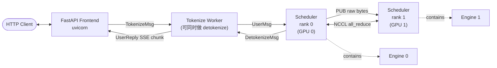

每个进程的角色：

| 进程                  | 数量          | 职责                                                                 |
| --------------------- | ------------- | -------------------------------------------------------------------- |
| **FastAPI Frontend**  | 1（父进程）   | HTTP 路由、SSE 流式响应、请求 uid 分配、客户端断连检测               |
| **Tokenize Worker**   | 1+ (默认 1，含 detokenize 角色) | text↔token 转换、流式 detokenize、handle 部分多字节字符  |
| **Scheduler (rank 0)**| 1             | 主调度器，唯一对外（与 tokenizer 通信）的 scheduler                  |
| **Scheduler (rank N)**| 0~tp_size-1   | 跟随 rank 0 的 broadcast，与 rank 0 通过 NCCL 协同 forward          |

**为什么这样切？**
- **GIL 隔离**：tokenize（纯 CPU）和 GPU forward 在不同进程，互不阻塞。
- **TP 必需**：每个 GPU 必须由独立 OS 进程持有（否则 NCCL/CUDA context 冲突）。
- **故障隔离**：tokenizer 解析异常不会拖垮 GPU 进程。

参考实现：`python/minisgl/server/launch.py:47-103`（`start_subprocess`）。

### 2.2 模块划分（Python 包结构）

```
python/minisgl/
├── __main__.py          # CLI 入口：python -m minisgl
├── core.py              # 核心数据类：Req, Batch, Context, SamplingParams
├── env.py               # 环境变量开关
├── shell.py             # 交互 shell 入口
│
├── server/              # HTTP 入口与进程编排
│   ├── args.py          # CLI 参数 → ServerArgs
│   ├── launch.py        # subprocess 编排（核心）
│   └── api_server.py    # FastAPI 路由 + FrontendManager + shell
│
├── tokenizer/           # tokenize/detokenize 进程
│   ├── server.py        # tokenize_worker 进程主循环
│   ├── tokenize.py      # TokenizeManager（HF tokenizer 包装）
│   └── detokenize.py    # DetokenizeManager（流式解码）
│
├── scheduler/           # 调度器（运行在每个 TP rank 上）
│   ├── scheduler.py     # Scheduler 主类 + overlap/normal loop
│   ├── io.py            # SchedulerIOMixin：rank-aware ZMQ I/O
│   ├── config.py        # SchedulerConfig
│   ├── table.py         # TableManager（请求槽位 + token_pool）
│   ├── cache.py         # CacheManager（页分配 + 前缀缓存桥接）
│   ├── prefill.py       # PrefillManager + PrefillAdder + ChunkedReq
│   ├── decode.py        # DecodeManager
│   └── utils.py         # PendingReq, ScheduleResult
│
├── engine/              # 单 TP rank 的 GPU 引擎
│   ├── engine.py        # Engine 主类 + forward_batch
│   ├── config.py        # EngineConfig
│   ├── graph.py         # GraphRunner（CUDA Graph 捕获/重放）
│   └── sample.py        # Sampler（greedy / top-k / top-p）
│
├── kvcache/             # KV cache 池与前缀缓存
│   ├── base.py          # 抽象接口：BaseKVCachePool, BasePrefixCache
│   ├── mha_pool.py      # MHAKVCache 实现
│   ├── naive_cache.py   # NaivePrefixCache（无前缀共享）
│   └── radix_cache.py   # RadixPrefixCache + RadixTreeNode
│
├── attention/           # Attention 后端
│   ├── base.py          # BaseAttnBackend + HybridBackend
│   ├── fa.py            # FlashAttention (FA3/FA4)
│   ├── fi.py            # FlashInfer
│   ├── trtllm.py        # TensorRT-LLM fmha
│   └── utils.py         # BaseCaptureData（CUDA Graph 持久 buffer）
│
├── layers/              # TP 感知模型层原语
│   ├── base.py          # BaseOP（替代 nn.Module 的反射式状态字典）
│   ├── linear.py        # 5 种 TP 线性变体
│   ├── attention.py     # AttentionLayer（无状态，只调 backend）
│   ├── embedding.py     # VocabParallelEmbedding + ParallelLMHead
│   ├── rotary.py        # RotaryEmbedding（functools.cache 共享）
│   ├── norm.py          # RMSNorm + RMSNormFused
│   ├── activation.py    # silu_and_mul, gelu_and_mul
│   └── moe.py           # MoELayer
│
├── models/              # 模型架构
│   ├── base.py          # BaseLLMModel
│   ├── config.py        # ModelConfig + RotaryConfig
│   ├── utils.py         # GatedMLP, MoEMLP, RopeAttn 通用块
│   ├── llama.py         # Llama-3 系列
│   ├── qwen2.py         # Qwen-2.5
│   ├── qwen3.py         # Qwen-3 (有 q/k norm)
│   ├── qwen3_moe.py     # Qwen-3 MoE
│   ├── register.py      # 架构 → 类映射
│   └── weight.py        # 权重加载 + 分片 + 合并
│
├── distributed/         # TP 抽象
│   ├── info.py          # DistributedInfo + 全局 (rank, size)
│   └── impl.py          # DistributedImpl 抽象 + Torch/PyNCCL 两种实现
│
├── moe/                 # MoE 后端（fused / fallback）
│
├── kernel/              # 自定义 CUDA/Triton kernels
│   ├── utils.py         # load_aot / load_jit (tvm-ffi 封装)
│   ├── store.py         # store_cache (KV scatter)
│   ├── index.py         # indexing (embedding gather)
│   ├── radix.py         # fast_compare_key (CPU)
│   ├── pynccl.py        # PyNCCL 包装
│   ├── moe_impl.py      # Triton MoE 胶水
│   ├── csrc/            # C++/CUDA 源码
│   │   ├── jit/         # 模板化 (按 shape 特化编译)
│   │   │   ├── store.cu
│   │   │   └── index.cu
│   │   ├── src/         # AOT 编译
│   │   │   ├── radix.cpp
│   │   │   ├── tensor.cpp
│   │   │   └── pynccl.cu
│   │   └── include/minisgl/  # 公共 header
│   └── triton/
│       └── fused_moe.py
│
├── message/             # ZMQ 消息类型
│   ├── backend.py       # 朝 scheduler 的：UserMsg, AbortBackendMsg, ExitMsg
│   ├── tokenizer.py     # 朝 tokenizer 的：TokenizeMsg, DetokenizeMsg, AbortMsg
│   ├── frontend.py      # 朝 FastAPI 的：UserReply
│   └── utils.py         # 自动序列化（递归走 __dict__，特化 1D Tensor）
│
├── utils/               # 通用工具
│   ├── logger.py        # info_rank0 等 rank-aware 日志
│   └── mp.py            # ZmqPushQueue / ZmqPullQueue / ZmqPub/Sub
│
├── llm/                 # 库内嵌入式入口
│   └── llm.py           # LLM 类（offline_mode）
│
└── benchmark/           # 性能测试
    ├── client.py
    └── perf.py
```

### 2.3 ZeroMQ 消息总线

进程间通过**5 个 IPC socket** 通信，地址都是 PID 后缀的 UNIX 域 socket（多个 mini-sglang 实例可同机共存）。

```
                    minisgl_4 (TokenizeMsg, AbortMsg)
   FastAPI ─────────────PUSH─────────────► Tokenizer 
   (PUB)                                   (PULL,bind)
       ▲
       │  minisgl_3 (UserReply)
       └──────────────PULL──────────────── Detokenizer
       (bind)                              (PUSH)

                    minisgl_0 (UserMsg, AbortBackendMsg)
   Tokenizer ──────────PUSH─────────────► Scheduler rank 0
                                           (PULL,bind)
                                              │
                                              │ minisgl_2 (raw bytes broadcast, TP > 1)
                                              ▼ PUB
                                           Scheduler rank 1..N-1 (SUB)

                    minisgl_1 (DetokenizeMsg)
   Scheduler ──────────PUSH─────────────► Detokenizer 
   rank 0                                  (PULL,bind)
```

**关键设计**：
- **单点 bind**：每个端点恰好一个进程 `bind`，其他都 `connect`，避免初始化竞争。
- **bind 在子进程 spawn 之前**：父进程先 bind 自己的端点，再 spawn 子进程去 connect，PUSH 不会丢消息。
- **PID 后缀**：同机多实例 `ipc:///tmp/minisgl_0.pid=1234` vs `pid=5678`，互不干扰。
- **共享 tokenizer 优化**：`--num-tokenizer 0`（默认）时，detokenizer 同时承担 tokenize 角色，`minisgl_4` 退化为 alias 到 `minisgl_1`，节省一个进程。

参考实现：`python/minisgl/server/args.py:30-50`、`python/minisgl/scheduler/io.py:27-65`、`python/minisgl/utils/mp.py:33-129`。

### 2.4 三种启动模式

| 模式             | 命令                                              | 行为                                                              |
| ---------------- | ------------------------------------------------- | ----------------------------------------------------------------- |
| **HTTP Server**  | `python -m minisgl --model X`                     | uvicorn + 子进程编排，提供 `/generate`、`/v1/chat/completions`     |
| **Interactive Shell** | `python -m minisgl --model X --shell`        | 同进程编排但用 `prompt_toolkit` REPL 替代 uvicorn，bs=1            |
| **Library (offline)** | `from minisgl.llm import LLM; LLM(...)`     | 单进程内嵌，跳过 tokenizer/detokenizer 子进程，用于 benchmark 等   |

代码入口：

```python
# __main__.py
from minisgl.server.launch import launch_server
launch_server()
```

```python
# server/launch.py:40
def launch_server(server_args=None, run_shell=False):
    server_args = server_args or parse_args()
    run_api_server(server_args, start_subprocess, run_shell=run_shell)
```

`run_shell=True` 时，`run_api_server` 走 `asyncio.run(shell())` 而非 `uvicorn.run`（`api_server.py:441-444`）。`shell()` 强制 `cuda_graph_max_bs=1, max_running_req=1, silent_output=True`（`args.py:231-234`）。

---

## 第 3 章 · 一次请求的完整旅程

下面用一个完整的 `/v1/chat/completions` 流式请求作为主线，串起所有子系统。所有细节实现在第 4 章展开。

### 3.1 时序图（端到端）

```mermaid
sequenceDiagram
    autonumber
    actor User
    participant FastAPI
    participant Tokenizer
    participant SchedR0 as Scheduler(rank0)
    participant SchedRn as Scheduler(rank>0)
    participant Engine
    participant Detok as Detokenizer

    User->>FastAPI: POST /v1/chat/completions {messages, stream:true}
    FastAPI->>FastAPI: new_user() → uid; 注册 asyncio.Event
    FastAPI->>Tokenizer: ZMQ PUSH TokenizeMsg(uid, text, sampling_params)
    FastAPI-->>User: 200 OK (SSE 通道打开)

    Tokenizer->>Tokenizer: apply_chat_template + encode → input_ids
    Tokenizer->>SchedR0: ZMQ PUSH UserMsg(uid, input_ids, sampling_params)

    SchedR0->>SchedRn: ZMQ PUB raw msgpack(UserMsg)
    SchedR0->>SchedRn: gloo broadcast(消息计数)
    SchedRn->>SchedRn: 解码 UserMsg，镜像状态

    SchedR0->>SchedR0: prefill_manager.add_one_req → PendingReq
    SchedR0->>SchedR0: schedule_next_batch（前缀匹配 + 分配 page_table 行）
    SchedR0->>SchedR0: prepare_batch（KV pages, positions, attn metadata）

    SchedR0->>Engine: forward_batch(prefill Batch)
    Engine->>Engine: Model.forward (embed → layers → LM head)
    Engine->>Engine: attn_backend.forward (写 paged KV)
    Engine->>Engine: Sampler.sample → next_tokens_gpu
    Engine-->>SchedR0: ForwardOutput(next_tokens_cpu, copy_done_event)

    SchedR0->>SchedR0: copy_done.synchronize()，append token，cache prefix
    SchedR0->>Detok: ZMQ PUSH DetokenizeMsg(uid, next_token, finished=false)

    Detok->>Detok: batch_decode + find_printable_text
    Detok->>FastAPI: ZMQ PUSH UserReply(uid, incremental_output)

    FastAPI->>FastAPI: listen() 协程消费; event_map[uid].set()
    FastAPI-->>User: SSE: data: {"choices":[{"delta":{"content":"<token>"}}]}
```

### 3.2 关键步骤拆解（按代码行数定位）

下面这张表给读者一份"哪个文件哪一行决定了这一步"的查询表。读完一遍后再回头看代码会非常清晰：

| #  | 角色          | 动作                                   | 位置                                                |
| -- | ------------- | -------------------------------------- | --------------------------------------------------- |
| 1  | User          | POST `/v1/chat/completions`            | （客户端）                                          |
| 2  | FastAPI       | `v1_completions` 收到，反序列化         | `server/api_server.py:256-279`                      |
| 3  | FastAPI       | `state.new_user()` 分配 uid             | `api_server.py:108`                                 |
| 4  | FastAPI       | 推 `TokenizeMsg` 到 `zmq_tokenizer_addr` | `api_server.py:267-279` + `utils/mp.py:33-47`       |
| 5  | FastAPI       | 返回 `StreamingResponse`，懒启 listen   | `api_server.py:281-284`                             |
| 6  | Tokenizer     | PULL 消息，分类 tokenize/detokenize/abort | `tokenizer/server.py:60-70`                       |
| 7  | Tokenizer     | `apply_chat_template` + `encode`        | `tokenizer/tokenize.py:14-31`                       |
| 8  | Tokenizer     | 推 `UserMsg` 到 `zmq_backend_addr`      | `tokenizer/server.py:87-101`                        |
| 9  | Sched rank 0  | `_recv_msg_multi_rank0`：PULL → PUB raw | `scheduler/io.py:88-107`                            |
| 10 | Sched rank>0  | gloo broadcast 计数 + ZMQ SUB 收消息    | `scheduler/io.py:109-122`                           |
| 11 | Sched rank 0  | `_process_one_msg(UserMsg)` → PendingReq | `scheduler/scheduler.py:175-189` + `prefill.py:123` |
| 12 | Sched rank 0  | `_schedule_next_batch` → PrefillAdder   | `scheduler/scheduler.py:219-225` + `prefill.py:39`  |
| 13 | Sched rank 0  | `_prepare_batch`：分页 + attn metadata | `scheduler/scheduler.py:204-217`                    |
| 14 | Engine        | `engine.forward_batch`                  | `engine/engine.py:193-208`                          |
| 15 | Engine        | model.forward → attention backend       | `models/llama.py:60` etc + `attention/*.py`         |
| 16 | Engine        | `Sampler.sample` + 异步 D2H 拷贝        | `engine/sample.py:71` + `engine/engine.py:204`      |
| 17 | Sched rank 0  | `_process_last_data`：copy_done.sync, EOS 检测 | `scheduler/scheduler.py:138-167`             |
| 18 | Sched rank 0  | 推 `DetokenizeMsg` 到 detokenizer       | `scheduler/io.py:124-130`                           |
| 19 | Detokenizer   | `DetokenizeManager.detokenize`           | `tokenizer/detokenize.py:70-111`                    |
| 20 | Detokenizer   | 推 `UserReply` 到 frontend              | `tokenizer/server.py:71-85`                         |
| 21 | FastAPI       | `listen()` 协程接收，set Event          | `api_server.py:117-129`                             |
| 22 | FastAPI       | `stream_chat_completions` 拼 SSE chunk  | `api_server.py:161-201`                             |
| 23 | FastAPI       | uvicorn 写 socket                       | （ASGI）                                            |
| 24 | User          | 收到 SSE chunk 渲染                     | （客户端）                                          |

读完这 24 步，整个系统骨架就清晰了。

### 3.3 失败/取消路径

客户端断开连接（按 Ctrl+C 或网络断了）：
1. `stream_with_cancellation`（`api_server.py:191`）轮询 `request.is_disconnected()`
2. 触发 `abort_user(uid)`（`api_server.py:200`）
3. 等待 100 ms 让 in-flight `UserReply` 排空（`api_server.py:204`）
4. 推 `AbortMsg` 给 tokenizer，被改写为 `AbortBackendMsg`
5. Scheduler 收到后路由到 `PrefillManager.abort_req` 或 `DecodeManager.abort_req`
6. 释放 page_table 行 + KV pages

整个取消链路可在 200 ms 内闭环。

---

## 第 4 章 · 子系统深度剖析

本章按子系统拆开讲。每节都遵循同样的结构：**目标 → 关键文件 → 数据结构 → 控制流 → 优化技巧 → 代码片段**。读者可按需挑章节读，章节之间相对独立。

### 4.1 Engine + API Server + IPC

#### 4.1.1 子系统目标

把三件事粘在一起：（1）GPU 推理引擎（一卡一份 `Engine`）；（2）FastAPI HTTP 入口；（3）多进程编排和 ZMQ 消息总线。读者可以把这一节当作"系统的脊梁"——剩下的章节都挂在这里。

#### 4.1.2 进程拓扑（精确版）

```
                     ┌─────────────────────────────────────────────────┐
                     │  父进程（python -m minisgl）                     │
                     │  ┌───────────────────────────────────────────┐   │
                     │  │ FastAPI app (uvicorn worker)              │   │
                     │  │ ├ FrontendManager                         │   │
                     │  │ │  ├ recv_tokenizer (PULL bind 3)         │   │
                     │  │ │  ├ send_tokenizer (PUSH bind/connect 4) │   │
                     │  │ │  ├ ack_map: {uid: List[UserReply]}      │   │
                     │  │ │  └ event_map: {uid: asyncio.Event}      │   │
                     │  │ └ listen() 后台协程                       │   │
                     │  └───────────────────────────────────────────┘   │
                     │  mp.Queue ack_queue   ←── 子进程 readiness ack  │
                     └────┬─────────────────────────┬──────────────────┘
                          │ spawn                  │ spawn
                          │                         │
            ┌─────────────┴─────────┐   ┌──────────┴───────────┐
            │ Scheduler rank 0      │   │ Detokenizer / Tokenizer │
            │  ├ Engine on cuda:0   │   │  ├ TokenizeManager       │
            │  ├ ZMQ PULL  (0)      │   │  ├ DetokenizeManager     │
            │  ├ ZMQ PUSH  (1)      │   │  ├ recv (PULL bind 1)    │
            │  └ ZMQ PUB   (2)      │   │  ├ send_backend (PUSH 0) │
            └────┬─────────────┬────┘   │  └ send_frontend(PUSH 3) │
                 │ NCCL        │ PUB    └──────────────────────────┘
                 │ (TP > 1)    ▼
            ┌────┴─────┐    Scheduler rank 1..N-1
            │ Scheduler│      ├ Engine on cuda:i
            │ rank 1   │      └ ZMQ SUB (2)
            └──────────┘
```

#### 4.1.3 Engine 的初始化六步

`Engine.__init__`（`engine/engine.py:30`）严格按下面六步初始化，每步失败都会被显式 panic：

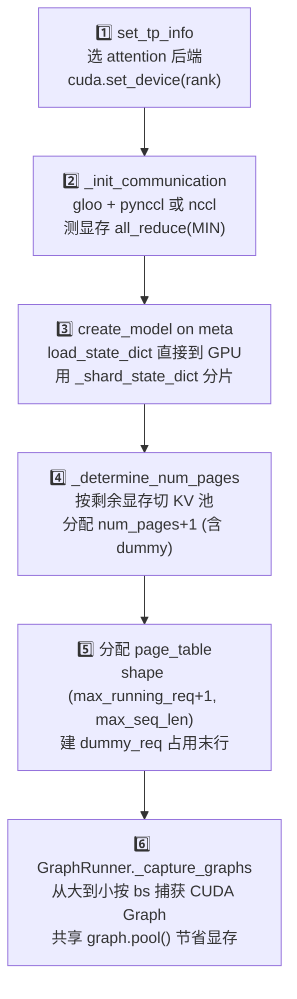

**显存测算细节**（`engine.py:150-170`）：

```
init_free  = 启动时 cuda.mem_get_info()[0]    # 模型加载前的可用显存
post_free  = 模型加载后再测一次
model_mem  = init_free - post_free            # 模型实际占用
available  = memory_ratio * init_free - model_mem   # 给 KV 用的预算
cache_per_page = 2 (K+V) × num_layers × page_size
                  × (num_kv_heads / tp_size) × head_dim × dtype.itemsize
num_pages  = available // cache_per_page
```

`memory_ratio` 默认 0.9（`args.py`），剩下 10% 给激活、临时 buffer、CUDA Graph workspace 等。

**all_reduce(MIN) 的妙用**（`engine.py:177-189`）：用一次 MIN reduce 同时拿到 min 和 max。把 `[free, -free]` 编码成 int64 vec2，MIN 后第二位再取负就是 max——免一次 collective。当跨 rank 显存差 > 2 GiB 时直接 panic。

#### 4.1.4 forward_batch 热路径

```python
# engine/engine.py:193-208
def forward_batch(self, batch: Batch, args: BatchSamplingArgs) -> ForwardOutput:
    assert torch.cuda.current_stream() == self.stream
    with self.ctx.forward_batch(batch):              # 设置全局 ctx 让 layers 能拿到 batch
        if self.graph_runner.can_use_cuda_graph(batch):
            logits = self.graph_runner.replay(batch)  # decode 走 CUDA Graph
        else:
            logits = self.model.forward()             # prefill 走 eager
    for req in batch.reqs:
        req.complete_one()                            # 推进 cached_len 和 device_len
    next_tokens_gpu = self.sampler.sample(
        logits[: batch.size], args).to(torch.int32)
    next_tokens_cpu = next_tokens_gpu.to(             # 异步 D2H
        "cpu", non_blocking=True)
    copy_done_event = torch.cuda.Event()
    copy_done_event.record(self.stream)               # event 让 scheduler 只等拷贝
    return ForwardOutput(next_tokens_gpu, next_tokens_cpu, copy_done_event)
```

三处微妙之处：
1. `ctx.forward_batch(batch)` 是 contextmanager，把当前 batch 推到 `Context._batch` 全局位置——Model 内的 attention 层会通过 `get_global_ctx().batch.attn_metadata` 拿到，避免逐层传参（CUDA Graph 捕获时尤为关键，因为 captured kernel 不能传额外参数）。
2. `non_blocking=True` D2H 让 sampler 出来的 token 拷贝到 host 不阻塞引擎流。
3. `copy_done_event` 让 scheduler 后续只 `event.synchronize()` 等这一次小拷贝（几十 byte），不必等整个 forward 排空。

#### 4.1.5 FrontendManager 的 uid 多路复用

FastAPI 进程里只有一个 `recv_tokenizer` PULL socket，但同时可能有几千个并发 SSE 流。`FrontendManager`（`api_server.py:100`）用 `uid` 为键多路复用：

```python
async def listen(self):
    while True:
        msg = await self.recv_tokenizer.get()
        for msg in _unwrap_msg(msg):
            if msg.uid not in self.ack_map:    # uid 已 abort，丢弃
                continue
            self.ack_map[msg.uid].append(msg)  # 进 buffer
            self.event_map[msg.uid].set()      # 唤醒等待的协程
```

每个 `/generate` 处理协程通过 `wait_for_ack(uid)` 异步生成器消费：

```python
async def wait_for_ack(self, uid):
    while True:
        await self.event_map[uid].wait()
        self.event_map[uid].clear()
        while self.ack_map[uid]:
            ack = self.ack_map[uid].pop(0)
            yield ack
            if ack.finished:
                del self.ack_map[uid]
                del self.event_map[uid]
                return
```

**懒启 listen**：第一个请求到达时才创建 `listen()` 协程（`api_server.py:126-129`），避免 uvicorn 启动时和 ASGI loop 抢初始化竞态。

#### 4.1.6 自动序列化（message/utils.py）

ZMQ payload 是 msgpack 字节，但 `UserMsg` / `DetokenizeMsg` 等消息类有 `torch.Tensor`、嵌套 dataclass 字段。`message/utils.py:20` 提供一个 100 行的递归序列化器：

```python
def serialize_type(obj):
    if isinstance(obj, torch.Tensor):
        return {"__type__": "Tensor", 
                "buffer": obj.numpy().tobytes(),
                "dtype": str(obj.dtype)}
    if hasattr(obj, "__dict__"):
        return {"__cls__": type(obj).__name__,
                **{k: serialize_type(v) for k, v in obj.__dict__.items()}}
    # primitives, list, tuple ...
```

**只支持 1D Tensor**——这是有意为之，因为 ZMQ 上跑的张量都是 input_ids / 索引这种 1 维数据。这避免了对 stride / view 的复杂处理。

#### 4.1.7 关键优化总结

| # | 优化                          | 位置                                | 收益                                       |
| - | ----------------------------- | ----------------------------------- | ------------------------------------------ |
| 1 | PID 后缀 IPC 路径             | `scheduler/config.py:8`             | 同机多实例不冲突                           |
| 2 | 单点 bind / 早 bind 后 spawn  | `api_server.py:403`、`io.py:27`     | 启动期不丢消息                             |
| 3 | 元数据 PUB 转发原始 bytes     | `io.py:88-107`                      | TP > 1 时省掉 decode/encode 双倍开销       |
| 4 | greedy 快路径                 | `engine/sample.py:54-56`            | 整批 greedy 时跳过 softmax + flashinfer    |
| 5 | non_blocking D2H + Event      | `engine/engine.py:204-208`          | scheduler 只 sync 几十字节而非整次 forward |
| 6 | 双流 overlap                  | `scheduler/scheduler.py:101-103`    | CPU/GPU 流水线并行                         |
| 7 | CUDA Graph bs 阶梯            | `engine/graph.py:49-67`             | decode 启动开销近零                        |
| 8 | dummy req + dummy KV page     | `engine/engine.py:89-98`            | batch padding 安全无副作用                 |
| 9 | msgpack copy=False            | `utils/mp.py:25-26, 47`             | 省一次 Python memcpy                       |
| 10 | 懒启 listen task              | `api_server.py:126-129`             | uvicorn 启动无竞态                         |
| 11 | per-uid ack_map + Event       | `api_server.py:117-152`             | 单 socket 扇出到上千 SSE                   |
| 12 | abort 100ms 宽限              | `api_server.py:204`                 | in-flight ack 安全排空                     |

---

### 4.2 Scheduler 核心：双流 overlap 调度

#### 4.2.1 子系统目标

Scheduler 是 mini-sglang 的"大脑"：每个 tick 决定 GPU 跑什么、按什么顺序、怎么准备元数据、怎么处理上一次的结果。下面这一段是**整本文档最重要的代码**，建议读三遍：

```python
# scheduler/scheduler.py:83-106
def overlap_loop(self, last_data: ForwardData | None) -> ForwardData | None:
    blocking = not (
        last_data is not None
        or self.prefill_manager.runnable
        or self.decode_manager.runnable
    )
    for msg in self.receive_msg(blocking=blocking):
        self._process_one_msg(msg)

    forward_input = self._schedule_next_batch()
    ongoing_data = None
    if forward_input is not None:
        with self.engine_stream_ctx:                 # ⭐ 切到 engine.stream
            self.engine.stream.wait_stream(self.stream)  # ⭐ 等 metadata H2D 完成
            ongoing_data = (forward_input, self._forward(forward_input))

    self._process_last_data(last_data)               # ⭐ 处理上一轮结果
    return ongoing_data
```

四个动作在一个 tick 里发生：
1. **收消息**（CPU）：drain ZMQ 队列，按消息类型分发；blocking 仅在没事可做时启用，避免空转。
2. **调度新 batch**（CPU 在 `scheduler.stream`）：选 prefill or decode，allocate KV pages，build 索引张量，prepare attention metadata，把 H2D 拷贝排到 `scheduler.stream`。
3. **启 forward**（GPU 在 `engine.stream`）：`wait_stream` 让 engine 等 H2D 完成，然后 model.forward + sample，最后 D2H 拷 next_tokens 同时记 event。
4. **处理上一轮**（CPU + 一次小 sync）：`copy_done.synchronize()`（只等 D2H 不等 forward），append 新 token，检测 EOS，free 资源，发 detokenize 消息。

#### 4.2.2 双流时间线

```
时间 ─────────────────────────────────────────────────────────►

scheduler.stream    │recv│sched│prep│   │recv│sched│prep│    │ ...
                                  ▲          ▲           ▲
                                  │ wait     │ wait      │
                                  ▼ stream   ▼ stream    ▼
engine.stream             │forward+sample│  │forward+sample│  │forward+sample│
                                ▲                ▲                ▲
                                │D2H+event       │D2H+event       │
                                ▼                ▼                ▼
CPU (Python)        │proc N-1│      │proc N│         │proc N+1│
                                                              ⏬
                              copy_done.synchronize()  仅等 ~64B 拷贝
```

**ENV.OVERLAP_EXTRA_SYNC**（`scheduler.py:122`）会在 forward_batch 前加一次 `self.stream.synchronize()`，是 issue #58 的 workaround；正常情况下不需要。

#### 4.2.3 核心数据结构

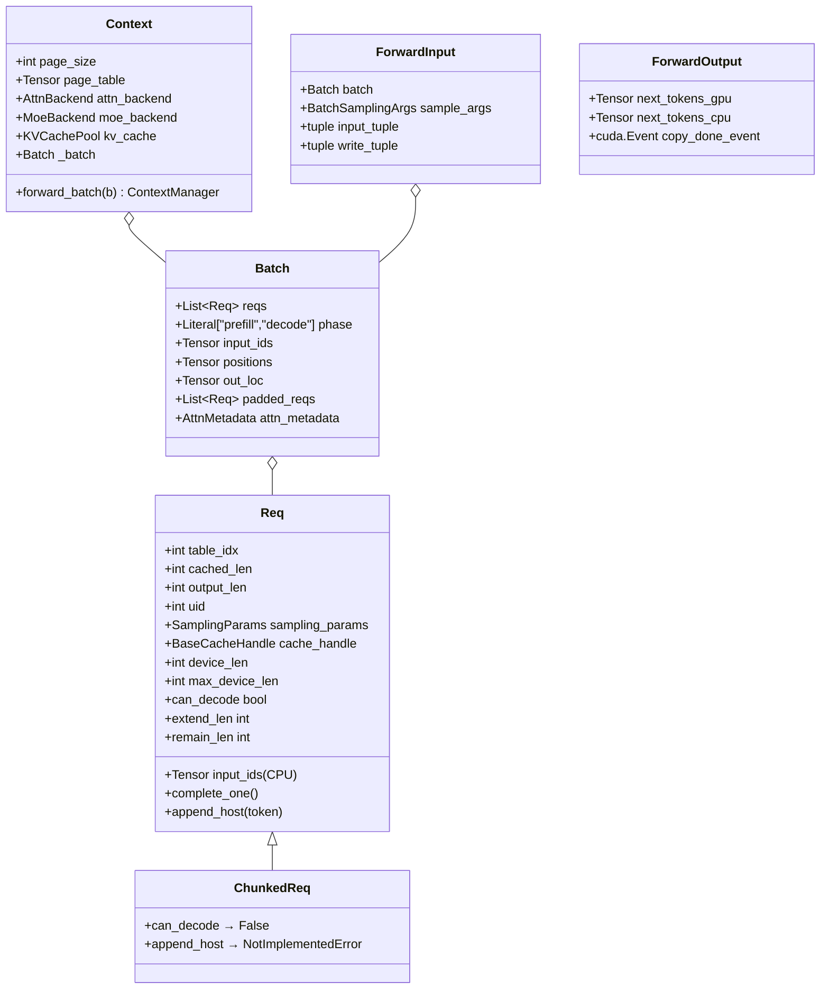

`Req` 的四个长度字段是理解整个调度的钥匙：

```
input_ids[0........cached_len.....device_len........max_device_len)
         │            │              │                    │
         │            │              │                    └── 最远能写到这里（max_tokens 后）
         │            │              └── 已经在 page_table 中分配了 KV 槽位
         │            └── 已经在前缀缓存命中、KV 已就位
         └── prompt 起点

extend_len = device_len - cached_len   # 本次 forward 要算的 token 数
remain_len = max_device_len - device_len # 还能 decode 多少步
can_decode = remain_len > 0             # 是否还活着
```

**Prefill 时**：`extend_len` = 几百到上千（chunk size），`device_len` 一次性跳到当前 chunk 的尾。  
**Decode 时**：`extend_len` = 1，`device_len` 每个 tick +1。

#### 4.2.4 一次 tick 的内部时序

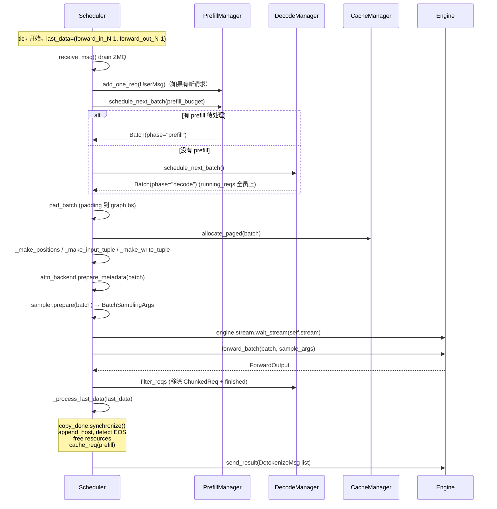

#### 4.2.5 ForwardInput 生命周期与 IMA 防护

`ForwardInput` 是个不起眼但极重要的 NamedTuple（`scheduler.py:35-39`）：

```python
class ForwardInput(NamedTuple):
    batch: Batch
    sample_args: BatchSamplingArgs
    input_tuple: tuple[Tensor, Tensor]   # (token_mapping, positions)
    write_tuple: tuple[Tensor, Tensor]   # (req_mapping, write_targets)
```

**为什么必须留住它跨 tick？** 在 overlap 模式下，下面这种事会发生：
- tick N：CPU 在 scheduler.stream 上构造 `input_tuple` 张量，issue H2D 拷贝
- tick N：engine.stream 上的 forward kernel 还没读完这些张量
- tick N+1：CPU 重新构造 `input_tuple`，旧的 ForwardInput 引用计数归零 → tensor 析构 → 物理显存归还 caching allocator
- tick N+1：caching allocator 把旧张量地址重分给别的 tensor
- tick N (delayed)：engine kernel 跑到读取阶段，访问已被复用的地址 → **IMA (Illegal Memory Access)**，CUDA driver 直接报错

解决办法就是把 ForwardInput 用 NamedTuple 装起来，作为 `last_data` 字段在两个 tick 之间存活。`scheduler.py:34` 的注释 `"we also need to cache some other data to avoid IMA"` 就是这个意思。

`finished_reqs: Set[Req]`（`scheduler.py:68`）解决另一个 overlap 怪象：tick N forward 完成的请求在 tick N+1 才 free 资源；同一个 Req 在 tick N+2 又被 `_process_last_data` 看见会重复 free。set 让"上一轮已 free"幂等。

#### 4.2.6 关键代码片段

**写 token 的散点写技巧**（`scheduler.py:264-269`）：

```python
def _make_write_tuple(batch: Batch, device: torch.device) -> Indice2D:
    mapping_list = [req.table_idx for req in batch.reqs]
    write_list = [(req.device_len if req.can_decode else -1) for req in batch.reqs]
    mapping_host = torch.tensor(mapping_list, dtype=torch.int64, pin_memory=True)
    write_host = torch.tensor(write_list, dtype=torch.int64, pin_memory=True)
    return mapping_host.to(device, non_blocking=True), write_host.to(device, non_blocking=True)
```

`-1` 给 ChunkedReq 和 dummy_req 用——它们不该被采样写回，但 batch 形状必须固定（CUDA Graph 要求）。`-1` 索引到 token_pool 末行的 dummy 槽，写入是无害的 no-op。

#### 4.2.7 优化清单

| # | 优化                              | 收益                              |
| - | --------------------------------- | --------------------------------- |
| 1 | 双流 overlap (`engine_stream_ctx`)| CPU 调度延迟被 GPU 计算掩盖       |
| 2 | ForwardInput cross-tick lifetime  | 避免 IMA                          |
| 3 | `finished_reqs` set 幂等防护      | overlap 下不重复 free             |
| 4 | greedy fast-path (Sampler.prepare)| 全 greedy batch 跳过 softmax      |
| 5 | pinned + non_blocking 元数据 H2D  | 与 GPU 计算重叠                   |
| 6 | `lazy_free_region` 批量 cat       | _process_last_data 里 free 合并   |
| 7 | token_pool 平行于 page_table      | 一次 fancy index 拿到整 batch token |
| 8 | Prefill-priority 与 chunked 头插  | 公平 + 不饿死 in-flight decode    |
| 9 | TP-aware 原始 bytes 转发          | rank0 不解码不重编                |
| 10 | inflight_tokens 预留              | prefill 不抢 decode 的 KV         |

---

### 4.3 Prefill 与 Decode 的协作

#### 4.3.1 子系统目标

每个 tick 决定 GPU 跑 prefill 还是 decode；如果 prefill prompt 太大就切块；prefill 完成后无缝接入 decode 队列；EOS 或 max_tokens 触发结束并释放资源。

#### 4.3.2 调度策略：一行短路或

```python
# scheduler/scheduler.py:219-225
def _schedule_next_batch(self) -> ForwardInput | None:
    batch = (
        self.prefill_manager.schedule_next_batch(self.prefill_budget)
        or self.decode_manager.schedule_next_batch()
    )
    return self._prepare_batch(batch) if batch else None
```

**Prefill 优先**——但 PrefillAdder 内部用 `inflight_tokens`（保留给 in-flight decode 的预算）防止把 KV 占满。

#### 4.3.3 Chunked Prefill：让长 prompt 也能合批

prompt 长 100k 时，一次性 prefill 会卡死整个 GPU。`PrefillAdder._add_one_req`（`prefill.py:65-90`）：

```python
def _add_one_req(self, pending_req, cache_handle, table_idx, cached_len) -> Req:
    remain_len = pending_req.input_len - cached_len
    chunk_size = min(self.token_budget, remain_len)   # ⭐ 切块
    is_chunked = chunk_size < remain_len
    CLS = ChunkedReq if is_chunked else Req           # ⭐ 子类标记
    self.token_budget -= chunk_size                   # 本轮预算
    self.reserved_size += remain_len + pending_req.output_len  # ⭐ 预占未来全部
    _slice = slice(cached_len, cached_len + chunk_size)
    device_ids = self.table_manager.token_pool[table_idx, _slice]
    device_ids.copy_(pending_req.input_ids[_slice].pin_memory(), non_blocking=True)
    return CLS(input_ids=pending_req.input_ids[: cached_len + chunk_size], ...)
```

三个关键设计：

**1. ChunkedReq 子类而非 flag**（`prefill.py:23-29`）
```python
class ChunkedReq(Req):
    @property
    def can_decode(self) -> bool: return False
    def append_host(self, token): raise NotImplementedError
```
`DecodeManager.filter_reqs` 用 `can_decode` 性质天然过滤掉 ChunkedReq；`_process_last_data` 用 `isinstance` 跳过采样。零分支扩散到调用方。

**2. 全量预占 reserved_size**：本 tick 只算 `chunk_size` 个 token，但 `reserved_size += remain_len + output_len`——把未来所有 chunk 加 decode 输出的空间一次性扣掉。**避免后续 chunk 来时发现 KV 已经被新 prompt 抢光**——chunked 请求保证不会死锁。

**3. Chunked 头插**（`prefill.py:140-150`）：上一轮没跑完的 chunked 请求被重新塞回 `pending_list` 头部，下一轮优先继续。既保公平（先到先服务）又限制 in-flight chunked 数量。

#### 4.3.4 状态机视图

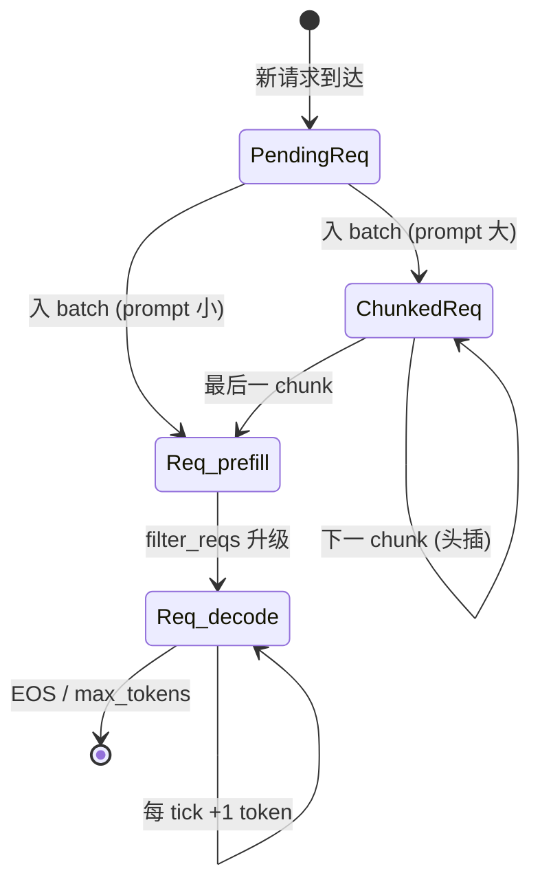

#### 4.3.5 inflight_tokens：跨 manager 协作

`DecodeManager.inflight_tokens`（`decode.py:27-30`）告诉 PrefillAdder：**先给我留这么多 KV，prefill 才能往剩下的里塞**：

```python
@property
def inflight_tokens(self) -> int:
    tokens_reserved = (self.page_size - 1) * len(self.running_reqs)  # ⭐ 跨页预留
    return sum(req.remain_len for req in self.running_reqs) + tokens_reserved
```

`(page_size - 1) * N` 的解释：每个 in-flight req 在最坏情况下，下一步 decode 会跨页边界，需要分配新页。N 个 req 各保留 `page_size - 1` 个槽。

#### 4.3.6 Termination：只检查两件事

```python
# scheduler/scheduler.py:147-167（节选）
for i, req in enumerate(batch.reqs):
    if isinstance(req, ChunkedReq):
        continue                                # chunk 不采样
    next_token = next_tokens_cpu[i]
    req.append_host(next_token.unsqueeze(0))
    next_token = int(next_token.item())
    finished = not req.can_decode               # ⭐ 长度
    if not req.sampling_params.ignore_eos:
        finished |= next_token == self.eos_token_id  # ⭐ EOS
    reply.append(DetokenizeMsg(uid=req.uid, next_token=next_token, finished=finished))
    if finished and req not in self.finished_reqs:
        self.decode_manager.remove_req(req)
        self._free_req_resources(req)
        new_finished_reqs.add(req)
    elif batch.is_prefill:
        self.cache_manager.cache_req(req, finished=False)  # ⭐ 把 prefix 入 radix cache
```

**只有两个停止条件**：max_tokens (`req.can_decode == False`) 和 EOS。**没有 stop string** 支持（OpenAI 的 `stop` 字段当前被忽略）。

`elif batch.is_prefill: cache_req(finished=False)` 的意思：prefill 完成后把刚算好的 prefix 插入 radix cache，下一个共享相同 system prompt 的请求就能命中。

#### 4.3.7 Token Pool 的并行写入

```
                  Token Pool（int32 [max_running_reqs+1, max_seq_len]）
                  ┌──────────────────────────────────────────────────┐
        table_idx │  [token0][token1][token2][token3][...][...]      │  ← Req 0
                  ├──────────────────────────────────────────────────┤
                  │  [token0][token1][...]                            │  ← Req 1
                  ├──────────────────────────────────────────────────┤
                  │  ...                                              │
                  ├──────────────────────────────────────────────────┤
                  │  [DUMMY][DUMMY][...]                              │  ← dummy_req
                  └──────────────────────────────────────────────────┘
                                     ▲                ▲
                                     │                │ next_tokens 散点写入这里
                                     │                  (-1 索引指向 dummy 行)
                                     │
                                     │ Scheduler._forward 用 input_mapping 一次 gather 整 batch
```

`token_pool` 与 `page_table` shape 相同（`table.py:9-11`），是一个并行结构。前者存 token id（CPU 角度），后者存 KV 页号（GPU 角度）。这俩配合就能把"取 input_ids"和"找 KV"都变成单次 fancy index。

---

### 4.4 KV Cache 池与 Radix 前缀缓存

#### 4.4.1 子系统目标

把所有请求的 KV 装进一块固定预算的显存里；让多个共享前缀的请求重用同一份 KV；处理分配、驱逐、锁定（防止驱逐还在用的页）。这是 mini-sglang 最复杂也最值得读的子系统。

#### 4.4.2 三层抽象

```
                 ┌──────────────────────┐
                 │  CacheManager        │  ← scheduler 看到的接口
                 │  - free_slots        │     match_req / allocate_paged / cache_req
                 │  - prefix_cache (强组合) │     lock / unlock / lazy_free_region
                 │  - page_table (引用)  │
                 └──────┬───────────────┘
                        │
        ┌───────────────┴───────────────────┐
        │                                   │
        ▼                                   ▼
┌─────────────────────┐           ┌─────────────────────┐
│ BasePrefixCache     │           │ BaseKVCachePool     │
│ - NaivePrefixCache  │           │ - MHAKVCache        │
│ - RadixPrefixCache  │           │   (单一大张量)      │
│   - RadixTreeNode  │           │   store_kv 写入      │
│   - 锁 + LRU 驱逐   │           │   attention 后端读出 │
└─────────────────────┘           └─────────────────────┘
```

#### 4.4.3 KV 池：一张 6 维大张量

```python
# kvcache/mha_pool.py:28
self._kv_buffer = torch.empty(
    (2, num_layers, num_pages, page_size, local_kv_heads, head_dim),
    device=device, dtype=dtype,
)
self._k_buffer = self._kv_buffer[0]   # 0 = K, 1 = V
self._v_buffer = self._kv_buffer[1]
self._storage_shape = (num_pages * page_size, local_kv_heads, head_dim)
```

```
              dim 0: K(0) / V(1)
              ↓
              ┌──────────────────────────────────────────────────┐
              │ ┌──────────────────────────────────────────────┐ │
       L 层 → │ │                                              │ │
              │ │  num_pages × page_size × kv_heads × head_dim │ │
              │ │                                              │ │
              │ └──────────────────────────────────────────────┘ │
              └──────────────────────────────────────────────────┘
                     ▲
                     │ flatten 成 (num_pages*page_size, kv_heads, head_dim)
                     │ store_kv 用 out_loc 索引散点写入
```

`local_kv_heads = num_kv_heads / tp_size`——KV 也是 head 切分的，每张卡只存自己负责的 head。

#### 4.4.4 Radix Tree：前缀树存 KV 页号

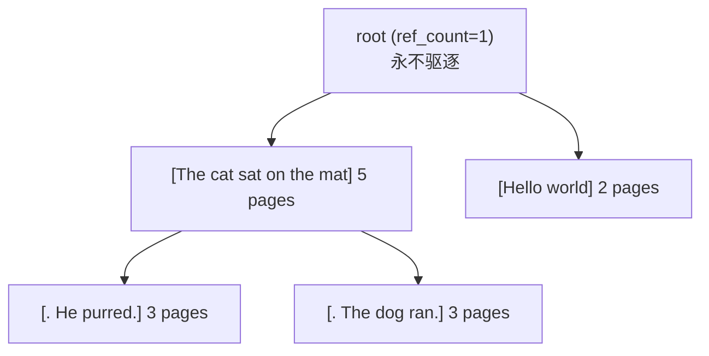

**每个节点的字段**（`radix_cache.py:17`）：

```python
class RadixTreeNode:
    children: Dict[hashable_key, RadixTreeNode]
    _parent: RadixTreeNode | None
    _key: torch.Tensor      # CPU int32/int64, 该边的 token id 切片
    _value: torch.Tensor    # CUDA int32, 同长度的 KV 页索引切片
    _length: int            # = len(_key) = len(_value)
    ref_count: int          # 0 时可驱逐
    timestamp: int          # LRU 用，每次访问 monotonic_ns
```

**节点表示一条边**：从父到自己的 token 段 + 对应 KV 页段。**累计 prefix** 是从 root 走到该节点所有 _key 拼接。

#### 4.4.5 前缀匹配：_tree_walk

```python
# kvcache/radix_cache.py:205
while prefix_len < indice_len:
    child_node = node.children.get(self.key_fn(input_ids[prefix_len:]))
    if child_node is None:
        return node, prefix_len
    node = child_node
    match_len = node.get_match_len(input_ids[prefix_len:])  # 内部调 fast_compare_key (C++)
    match_len = align_down(match_len, self.page_size)        # ⭐ 必须页对齐
    prefix_len += match_len
    if match_len != node.length:
        node = node.split_at(match_len)                      # ⭐ 边切分
        return node, prefix_len
    node.timestamp = tic                                     # LRU touch
```

**关键技巧**：
1. **`key_fn` 哈希仅取首页**（`radix_cache.py:233`）：`children` 字典的 key 是 token_ids 的前 page_size 个 id 的元组（page_size==1 时退化为单 int）。这样 children 查找是 O(1) bucket，不用扫遍所有兄弟。
2. **C++ `fast_compare_key`**（`kernel/csrc/src/radix.cpp:19`）：用 `std::mismatch` 比较两个 1D 整数张量首个不同的位置。Python 循环慢得多。
3. **`align_down(match_len, page_size)`**：partial 页没意义（paged attention 不能查半页），所以匹配长度向下对齐到页。
4. **`split_at(pos)`**（`radix_cache.py:69`）：节点边的部分匹配——把节点切成 `[0:pos]`（新父）+ `[pos:]`（自己）。新父继承旧 ref_count，确保锁定关系不破。

#### 4.4.6 锁定与驱逐

每个被某请求"正在用"的节点要锁定，否则可能被驱逐：

```python
# radix_cache.py:113
def lock_handle(self, handle: RadixCacheHandle, delta: int):
    node = handle.node
    while not node.is_root():
        was_zero = node.ref_count == 0
        node.ref_count += delta                  # +1 锁定 / -1 解锁
        now_zero = node.ref_count == 0
        if was_zero != now_zero:
            self.evictable_size += delta * node.length   # 移动 evictable ↔ protected
            self.protected_size -= delta * node.length
        node = node.parent
```

**驱逐**（`radix_cache.py:148`）：

```python
def evict(self, size_needed):
    leave_nodes = self._collect_leave_nodes_for_evict()  # ref_count==0 的叶子
    heapq.heapify(leave_nodes)                            # 按 timestamp 最小堆
    evicted = []
    while evicted_size < size_needed:
        node = heapq.heappop(leave_nodes)
        evicted.append(node.value)
        del node.parent.children[self.key_fn(node._key)]
        if node.parent.is_leaf() and node.parent.ref_count == 0:
            heapq.heappush(leave_nodes, node.parent)      # 父成新叶子
```

LRU 通过 `RadixTreeNode.__lt__` 比较 timestamp 实现。Root 永不驱逐——`ref_count=1` 初始化（`radix_cache.py:111`）。

#### 4.4.7 CacheManager 的桥接职责

```python
# scheduler/cache.py:42 (allocate_paged 简化)
def allocate_paged(self, batch):
    new_pages_per_req = [
        div_ceil(req.device_len, self.page_size) - div_ceil(req.cached_len, self.page_size)
        for req in batch.reqs
    ]
    total = sum(new_pages_per_req)
    if total > len(self.free_slots):
        self.prefix_cache.evict(total - len(self.free_slots))
        # evict 返回的 token 索引重新加入 free_slots
    self._allocate(batch, new_pages_per_req)
    self._write_page_table(batch, new_pages_per_req)
```

```python
# scheduler/cache.py:67 (cache_req)
insert_ids = req.input_ids[: req.cached_len]
page_indices = self.page_table[req.table_idx, : req.cached_len]
old_handle = req.cache_handle
cached_len, new_handle = self.prefix_cache.insert_prefix(insert_ids, page_indices)
self.unlock(old_handle)
# 释放掉与已有 prefix 重复的部分（别人已经先算好了）
self._free(page_indices[old_handle.cached_len : cached_len])
if finished:
    self._free(page_indices[new_handle.cached_len :])  # 释放尾部不对齐部分
else:
    req.cache_handle = new_handle
    self.lock(new_handle)                              # 继续锁住给 decode 用
```

#### 4.4.8 lazy_free_region 的小优化

```python
# scheduler/cache.py:93
@contextmanager
def lazy_free_region(self):
    self._free, self._old_free = self.lazy_free, self._free
    self.lazy_free_list = []
    yield
    self._free = self._old_free
    if self.lazy_free_list:
        self.free_slots = torch.cat([self.free_slots, *self.lazy_free_list])
```

`_process_last_data` 整个被这个 context 包裹（`scheduler.py:146`），里面 N 个请求各自 `_free` 一段碎片。在 region 退出时一次性 `torch.cat` 合并——避免 N 次 `torch.cat` 的 O(N²) 开销。

#### 4.4.9 一次完整的请求 KV 时序

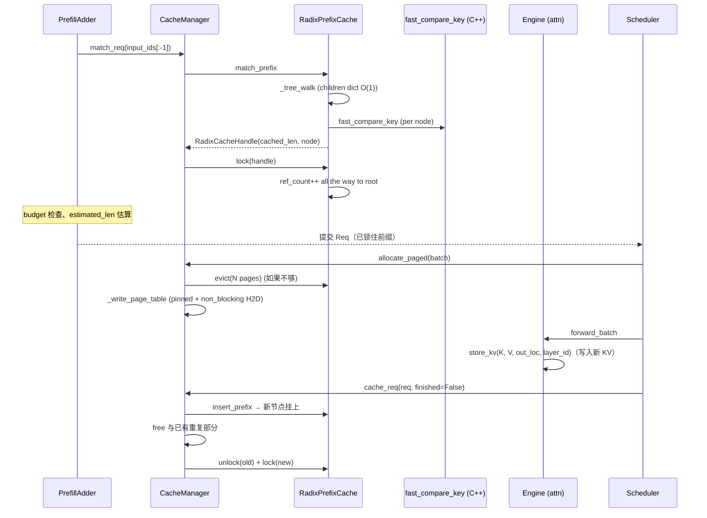

#### 4.4.10 优化清单

| # | 优化                                  | 收益                                       |
| - | ------------------------------------- | ------------------------------------------ |
| 1 | 一张 6D 大张量复合 K/V                | 局部性、少 1 次 alloc                      |
| 2 | free_slots 存 token 索引非 page 索引   | allocate 时直接展开，省 reshape            |
| 3 | C++ `fast_compare_key`（std::mismatch）| 比 Python/torch 快 10x+                   |
| 4 | children dict 仅哈希首页              | 节点 children 查找 O(1)                   |
| 5 | `align_down` 页对齐插入               | partial 页不存                            |
| 6 | `indices[prefix_len:].clone()`        | 切走的尾部不会被后续 page_table 写入污染   |
| 7 | heap-based LRU + 懒推父节点           | 驱逐 O(log N)                             |
| 8 | `lazy_free_region` 合并 cat           | 避免 N² 内存碎片                          |
| 9 | pinned + non_blocking page_table 写   | H2D 与 GPU 计算重叠                        |
| 10 | Root ref_count=1 永不驱逐            | 边界条件统一                              |

---

### 4.5 模型定义与 TP 感知层

#### 4.5.1 子系统目标

定义 transformer 模型架构（Llama / Qwen2 / Qwen3 / Qwen3-MoE），让模型代码本身**不感知 TP**——TP 知识被压进 5 种 Linear 原语和几个 embedding/LM head 类。同时直接从 HF safetensors 加载权重，按 rank 切分 + 合并 q/k/v 与 gate/up。

#### 4.5.2 BaseOP：60 行替代 nn.Module

```python
# layers/base.py:56
def state_dict(self, *, prefix="", result=None):
    result = result or {}
    for name, param in self.__dict__.items():
        if name.startswith("_"):              # _layer_id, _comm 等私有字段不进 state_dict
            continue
        if isinstance(param, torch.Tensor):
            result[_concat_prefix(prefix, name)] = param
        elif isinstance(param, BaseOP):
            param.state_dict(prefix=_concat_prefix(prefix, name), result=result)
    return result
```

**反射式状态字典**：把 `self.__dict__` 当树遍历，张量是叶子参数，BaseOP 子节点递归。这种风格的好处：

- 无需 `register_buffer`/`register_parameter` 样板
- 加新字段零成本
- `_` 前缀字段（`_layer_id`、`_comm`、`_tp_size`）天然被过滤
- `OPList`（`base.py:132-154`）让 `model.layers.0.qkv_proj.weight` 这种 HF 风格的 key 自然映射

#### 4.5.3 五种 TP 线性原语

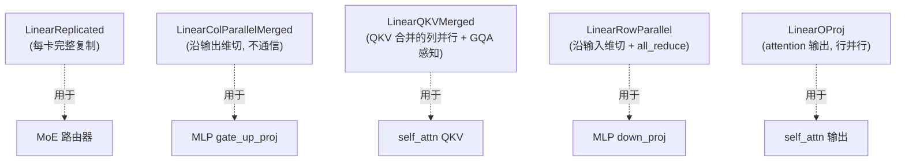

**LinearQKVMerged 的 GQA 数学**（`linear.py:71-88`）：

```python
# Llama-3 GQA 例子: num_qo_heads=32, num_kv_heads=8, head_dim=128, tp_size=4
GQA_ratio = num_qo_heads // num_kv_heads  # 4
local_num_kv = num_kv_heads // tp_size     # 2
local_osize = (GQA_ratio + 2) * local_num_kv * head_dim  
            = (4 + 2) * 2 * 128 = 1536      # 每张卡 = 8 Q + 2 K + 2 V 个 head 维度
```

⚠️ 注意是按 KV head 切，不是按 Q head 切——这是必须的，因为 GQA 一组 Q head 共享同一组 KV，必须放在同一张卡。

#### 4.5.4 一个 decoder 层的 TP 数据流

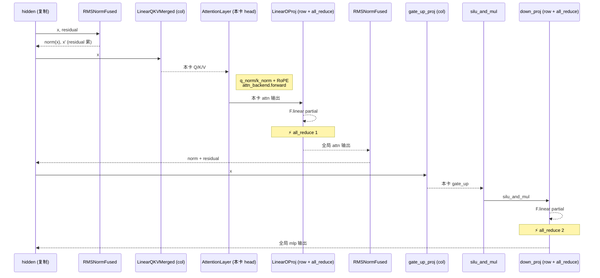

**整层只有 2 次 all_reduce**——这是 Megatron 风格 TP 的经典结论。

#### 4.5.5 模型组装：四个文件几乎一样

```python
# models/llama.py 简化
class LlamaDecoderLayer(BaseOP):
    def __init__(self, config, layer_id):
        self._layer_id = layer_id
        self.self_attn = RopeAttn(..., has_qk_norm=False, has_attn_bias=False)
        self.mlp = GatedMLP(...)
        self.input_layernorm = RMSNormFused(...)
        self.post_attention_layernorm = RMSNormFused(...)
    def forward(self, x, residual):
        x, residual = self.input_layernorm.forward(x, residual)
        x = self.self_attn.forward(x)
        x, residual = self.post_attention_layernorm.forward(x, residual)
        x = self.mlp.forward(x)
        return x, residual

# models/qwen3.py 唯一区别：has_qk_norm=True
# models/qwen2.py 唯一区别：has_attn_bias=True
# models/qwen3_moe.py 唯一区别：mlp = MoEMLP(...)
```

`RopeAttn`（`models/utils.py:81`）和 `GatedMLP` / `MoEMLP`（`utils.py:25/53`）是公共积木块，大部分模型差异都被这两个 flag 吃掉了。

#### 4.5.6 RotaryEmbedding 全模型共享

```python
# layers/rotary.py:101
@functools.cache
def get_rope(head_dim, rotary_dim, max_position, base, scaling):
    return RotaryEmbedding(head_dim, rotary_dim, max_position, base, scaling)
```

Llama-3 32 层每层 attention 都调 `get_rope(...)` 同一参数 → 同一 RotaryEmbedding 实例。`cos_sin_cache` 张量（`max_position × rotary_dim`）就只分配一份。

#### 4.5.7 RMSNormFused：把 residual 揉进 norm

```python
# layers/norm.py:32
def forward(self, x, residual):
    if residual is None:                        # 第一次调用
        return self.rmsnorm(x), x               # 把 x 自己当 residual 返回
    self.fused_add_rmsnorm(x, residual, ...)    # 后续：原地融合 add + norm
    return x, residual
```

调用形式：

```python
x, residual = self.input_layernorm(x, residual)        # ⭐ residual 作为接力棒
x = self.self_attn(x)
x, residual = self.post_attention_layernorm(x, residual)
x = self.mlp(x)
# ...
x = self.norm(x, residual)[0]                          # 最后一次取 [0] 丢掉 residual
```

省掉了显式的 `x = x + residual; norm(x)` 两遍读写，融合 kernel 直接原地干完。

#### 4.5.8 权重加载：直接落 GPU + 分片 + 合并

```python
# models/weight.py:80-88
for file in tqdm(sorted(files), disable=disable_tqdm):
    with safetensors.safe_open(file, framework="pt", device=device_str) as f:  # ⭐ 直落 GPU
        for name in f.keys():
            state_dict[name] = f.get_tensor(name)
if tp_info.size > 1:
    state_dict = _shard_state_dict(state_dict)           # 切片
return _merge_state_dict(state_dict)                     # 合并 q/k/v 和 gate/up
```

`_shard_state_dict` 规则（`weight.py:13-42`）：

| HF 权重名                                 | TP 切法               |
| ---------------------------------------- | --------------------- |
| `.q_proj`/`.k_proj`/`.v_proj`/`.gate_proj`/`.up_proj` | dim 0 (输出维) 切 |
| `.o_proj`/`.down_proj`                   | dim 1 (输入维) 切    |
| `lm_head`/`embed_tokens`                 | vocab 维度切片        |
| 其他                                     | 复制                  |

`_merge_state_dict`（`weight.py:45-68`）然后把 `q_proj + k_proj + v_proj` 沿 dim 0 cat 成 `qkv_proj`，`gate_proj + up_proj` cat 成 `gate_up_proj`——和 LinearQKVMerged / LinearColParallelMerged 一致。

合并好处：runtime 1 次 GEMM 替代 3 次（QKV 各算）；先切再 cat 保证仍然是 TP 本地操作。

#### 4.5.9 Meta-device 模型构建

```python
# engine/engine.py:50-52
set_rope_device(device)
with torch.device("meta"), self.config.dtype:
    self.model = create_model(self.config.model_config)
self.model.load_state_dict(load_weight(...))
```

**meta device 的妙处**：在 meta 上 `torch.empty(shape)` 不分配实际显存，只记 shape/dtype。模型整棵树构造完毕后峰值显存还是 0；`load_state_dict` 把 meta 张量替换为真张量时一次完成全部分配。**峰值显存 = 模型大小，不是 2×**。

但有副作用：RoPE 的 cos_sin_cache 需要在真设备上预计算，所以要 `set_rope_device(device)` 先告诉它别用 meta。

---

### 4.6 Attention 后端（FlashAttention / FlashInfer / TRT-LLM）

#### 4.6.1 子系统目标

提供 3 种 attention 算子的统一接口，让模型代码（`AttentionLayer.forward`）一行调用 `ctx.attn_backend.forward(q, k, v, layer_id, batch)` 就能跑遍三种 kernel。同时支持**混合后端**：prefill 用 A，decode 用 B（默认 Hopper 上是 `fa,fi`）。

#### 4.6.2 后端选择策略

```python
# engine/engine.py:224 (auto)
if config.attention_backend == "auto":
    backend = "trtllm" if is_sm100_supported() else (
        "fa,fi" if is_sm90_supported() else "fi"
    )
```

| GPU 架构          | 默认后端  | 解释                                                           |
| ----------------- | --------- | -------------------------------------------------------------- |
| Blackwell (SM100) | `trtllm`  | NVIDIA 自家最新 fmha kernel                                    |
| Hopper (SM90)     | `fa,fi`   | FA3 prefill (NV 之外最快) + FlashInfer decode (小 batch 强)    |
| 旧卡              | `fi`      | FlashInfer 通吃                                                |

`HybridBackend`（`base.py:37`）按 `batch.is_prefill` 路由：

```python
def forward(self, *args, batch):
    return (self.prefill_backend if batch.is_prefill 
            else self.decode_backend).forward(*args, batch=batch)
```

#### 4.6.3 五个抽象方法

```python
class BaseAttnBackend(ABC):
    @abstractmethod
    def forward(self, q, k, v, layer_id, batch): ...
    @abstractmethod
    def prepare_metadata(self, batch): ...           # 每个 tick 都调
    @abstractmethod
    def init_capture_graph(self, max_bs, max_seq): ... # CUDA Graph 捕获前
    @abstractmethod
    def prepare_for_capture(self, batch): ...         # 每个 graph_bs 捕获前
    @abstractmethod
    def prepare_for_replay(self, batch): ...          # 每次 replay 前
```

**Metadata 是后端状态的承载**：`prepare_metadata` 把 `batch.attn_metadata` 写好，`forward` 读它。这种设计让：
- model 代码不知道后端类型
- CUDA Graph 里同一段 metadata buffer 被 in-place 改写

#### 4.6.4 三种后端 metadata 的差异

```
全局 page_table 永远按 page_size=1 视角存储  (core.py:103)
  ↓
  ├─ FA / TRT-LLM: 切片每 page_size 列 + 整数除 page_size，得密集 [bs, ceil(max_seq/page_size)]
  │
  └─ FlashInfer: page_size 锁死=1，indices 是 1D ragged 拼接
                  KV cache 自身 _flatten_cache 改 view (page_size=1)
```

**FAMetadata**:
```
cu_seqlens_k:  [GPU, int32, bs+1]  累加 KV 长度
cu_seqlens_q:  [GPU, int32, bs+1]  累加 Q 长度
cache_seqlens: [GPU, int32, bs]    每请求总 KV 长
page_table:    [GPU, int32, bs × max_pages]  密集页表
max_seqlen_k, max_seqlen_q: int
```

**FIMetadata** (混 CPU/GPU)：
```
cu_seqlens_q_cpu, cu_seqlens_k_cpu: pinned CPU int32  ← FlashInfer.plan() 要 CPU
indices: [GPU, int32, ragged]                          ← 1D 拼接所有请求
last_page_len_cpu: pinned CPU int32 全 1               ← page_size=1 时永远是 1
wrapper: BatchPrefill/Decode/CUDAGraphBatchDecode      ← 根据相位选
initialized: bool                                       ← 控制 lazy plan() 触发
```

**TRTLLMMetadata** 与 FAMetadata 完全一样，复用同样的 prepare 逻辑。

#### 4.6.5 cu_seqlens_q 的三条快路径

```python
# attention/fa.py:84-90, 同样在 fi.py 和 trtllm.py
if max_seqlen_q == 1:                                # 纯 decode
    cu_seqlens_q = torch.arange(0, padded_size + 1, device=device, dtype=torch.int32)
elif all(l == 0 for l in cached_lens):               # 全是新 prefill (无前缀缓存命中)
    cu_seqlens_q = cu_seqlens_k                      # ⭐ 直接复用，零计算
else:                                                # 混合：部分 cache 命中的 chunked prefill
    cu_seqlens_q = torch.tensor([0] + seqlens_q, **CPU_KWARGS).cumsum_(dim=0)
    cu_seqlens_q = cu_seqlens_q.to(device, non_blocking=True)
```

**纯 decode 时 cu_seqlens_q = [0, 1, 2, ..., bs]** 是个常量——CUDA Graph 捕获时直接预填 arange，replay 时根本不用碰这个 buffer。

#### 4.6.6 CUDA Graph 与 attention 的耦合

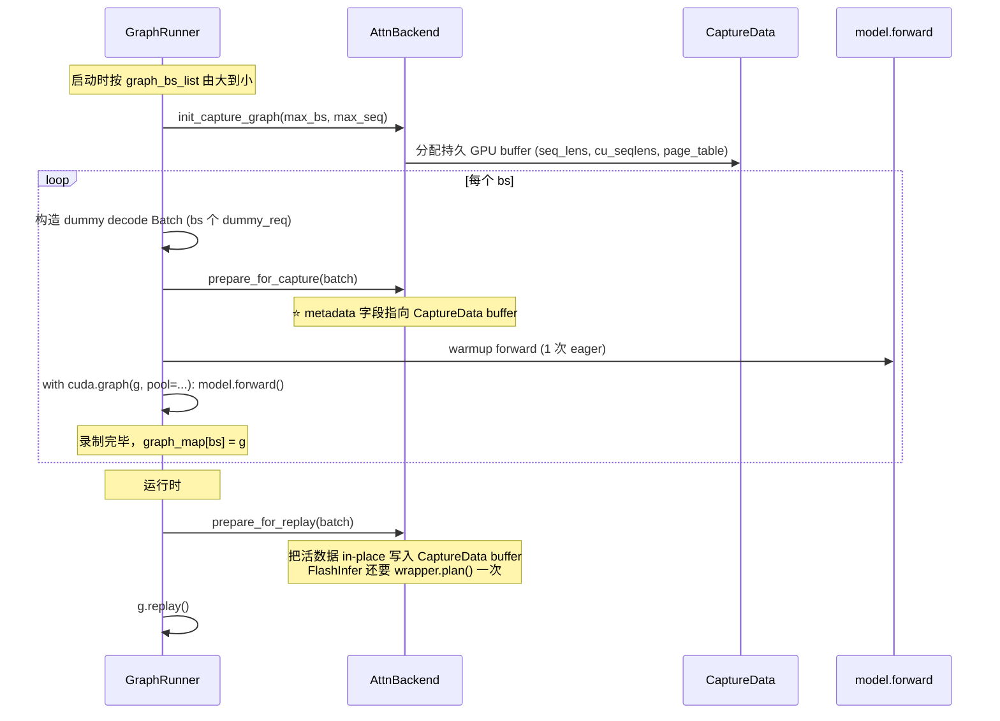

**BaseCaptureData**（`attention/utils.py`）的设计：

```
seq_lens:      [GPU, int32, max_bs]          初值 1（dummy req 用）
positions:     [GPU, int32, max_bs]
cu_seqlens_k:  [GPU, int32, max_bs+1]        初值 = arange (decode 时不变)
cu_seqlens_q:  [GPU, int32, max_bs+1]        初值 = arange ⭐ replay 永不改
page_table:    [GPU, int32, max_bs×max_seq]  decode 时只改这个 + seq_lens
```

`fa.py:132` 的注释 `"cu_seqlens_q is always [0, 1, 2, ..., bs] for decode (i.e. no-op)"` 就在说这件事。

#### 4.6.7 AttentionLayer 的 9 行核心

```python
# layers/attention.py:47-57
def forward(self, qkv: torch.Tensor) -> torch.Tensor:
    ctx = get_global_ctx()
    q, k, v = qkv.split([self.qo_attn_dim, self.kv_attn_dim, self.kv_attn_dim], dim=-1)
    if self.q_norm is not None:                          # Qwen3 用
        self.q_norm.forward_inplace(q.view(-1, self.num_qo_heads, self.head_dim))
    if self.k_norm is not None:
        self.k_norm.forward_inplace(k.view(-1, self.num_kv_heads, self.head_dim))
    q, k = self.rotary.forward(ctx.batch.positions, q, k)  # 原地 RoPE
    q = q.view(-1, self.num_qo_heads, self.head_dim)
    o = ctx.attn_backend.forward(q, k, v, self.layer_id, ctx.batch)
    return o.view(-1, self.qo_attn_dim)
```

整层无状态——只持有 head 配置和共享 RoPE 实例。所有真活在 `attn_backend.forward` 里：

1. `kvcache.store_kv(k, v, batch.out_loc, layer_id)` 把新 K/V 散点写入 paged 池
2. 调底层 kernel（`flash_attn_with_kvcache` / `wrapper.run` / `trtllm_batch_*_with_kv_cache`）

---

### 4.7 分布式与 Tensor Parallel

#### 4.7.1 子系统目标

启动 N 个 TP rank 进程，让它们形成一个 NCCL world，提供 `all_reduce`/`all_gather` 给 layers 调；同时为 control-plane 维护一个 CPU 通信组（gloo）做对象广播、count 同步、free-memory min/max 等。

#### 4.7.2 双通信路径

```
┌──────────────────────────────────────────────────────────────┐
│ torch.distributed                                            │
│                                                              │
│   ┌─── WORLD = gloo ──┐         ┌── WORLD = nccl ──┐         │
│   │ (use_pynccl=True   │         │ (use_pynccl=False) │         │
│   │   默认)            │         │                    │         │
│   │ tp_cpu_group=WORLD │         │ tp_cpu_group =     │         │
│   │                    │         │   new_group(gloo)  │         │
│   └────────┬───────────┘         └─────────┬──────────┘         │
│            │                               │                    │
└────────────┼───────────────────────────────┼────────────────────┘
             │                               │
             ▼ broadcast_object_list (NCCL UID)
             │
             ▼ all_reduce(MIN) free memory     ← 都用 gloo 做控制面
             │
             ▼ broadcast(msg_count)             ← Scheduler IO 同步
             │
             ▼ barrier (启动 ack)
             
             ┌────────── PyNCCL ───────────┐
             │ DistributedCommunicator     │
             │  .plugins[-1] = PyNCCLImpl  │  ← layers all_reduce/all_gather
             │  ↓                          │
             │  NCCLWrapper (C++)          │
             │  - ncclCommInitRank         │
             │  - 预注册 symmetric mem buf │
             │  - all_reduce/all_gather    │
             └─────────────────────────────┘
```

**为什么默认 WORLD=gloo？** 因为 `broadcast_object_list` 必须用 gloo（NCCL 不能序列化 Python 对象），如果 WORLD=nccl 还得另开一个 gloo 子组。直接 WORLD=gloo + PyNCCL 旁路更简洁。

#### 4.7.3 PyNCCLDistributedImpl 与插件栈

```python
# distributed/impl.py:63-70
class DistributedCommunicator:
    plugins: List[DistributedImpl] = [TorchDistributedImpl()]   # 类属性栈
    
    def all_reduce(self, x):
        return self.plugins[-1].all_reduce(x)   # 总取栈顶
    def all_gather(self, x):
        return self.plugins[-1].all_gather(x)
```

**Stack 模式的好处**：每个 layer 在 `__init__` 时只 `self._comm = DistributedCommunicator()`（无状态对象），不用关心当前生效的是哪种实现。`enable_pynccl_distributed` 只是 `plugins.append(...)` 一下，所有 layer 立即升级到 PyNCCL，无需重新构造。

#### 4.7.4 PyNCCL bootstrap

```python
# kernel/pynccl.py:45
def init_pynccl(tp_rank, tp_size, tp_cpu_group, max_bytes):
    if tp_rank == 0:
        id_list = [module.create_nccl_uid()]                  # 128 bytes
        torch.distributed.broadcast_object_list(id_list, src=0, group=tp_cpu_group)
    else:
        id_list = [None]
        torch.distributed.broadcast_object_list(id_list, src=0, group=tp_cpu_group)
    nccl_id = id_list[0]
    return cls(tp_rank, tp_size, max_bytes, nccl_id)         # NCCLWrapper(C++)
```

#### 4.7.5 NCCL 2.27 Symmetric Memory Window

C++ 侧的关键代码（`kernel/csrc/src/pynccl.cu:74`）：

```cpp
NCCLWrapper(int rank, int world_size, size_t max_bytes, NCCLIDList uid) {
  ncclCommInitRank(&comm, world_size, get_uid(uid), rank);
  ncclMemAlloc(&buf, max_bytes);                            // ⭐ NCCL 管理的 GPU 内存
  ncclCommWindowRegister(comm, buf, max_bytes,              // ⭐ 注册为对称窗口
                         &win, NCCL_WIN_COLL_SYMMETRIC);
  // shared_ptr 析构顺序：window 先于 comm
}

void all_reduce(TensorView t, std::string op) {
  if (size_bytes <= m_max_bytes) {
    if (need_memcpy)
      cudaMemcpyAsync(buf_ptr, data_ptr, size_bytes, D2D, stream);
    ncclAllReduce(buf_ptr, buf_ptr, count, dtype, op, comm, stream);  // ⭐ in-place
    if (need_memcpy)
      cudaMemcpyAsync(data_ptr, buf_ptr, size_bytes, D2D, stream);
  } else {
    ncclAllReduce(data_ptr, data_ptr, count, dtype, op, comm, stream);
  }
}
```

**Symmetric Memory Window** 是 NCCL 2.27 提供的优化：当所有 rank 的 buffer 在虚拟地址空间是相同 VA 时，NCCL 可以走 NVLINK SHARP / one-shot 算法，比 ring 算法低延迟得多。代价是必须用 `ncclMemAlloc` + `ncclCommWindowRegister` 申请专门的 buffer。mini-sglang 把 buffer 大小定为 `max_forward_len × hidden_size × dtype.itemsize`（封顶 1 GiB），覆盖最大的激活张量。

**get_buffer() 暴露**：`NCCLWrapper::get_buffer()` 让外部 kernel 可以直接写 symmetric buffer，下次 all_reduce 跳过 cudaMemcpyAsync。这是给将来 fuse kernel + comm 留的扩展点。

#### 4.7.6 Free Memory MIN+MAX 的精巧编码

```python
# engine/engine.py:177-189 (简化)
free_mem = torch.cuda.mem_get_info()[0]
data = torch.tensor([free_mem, -free_mem], dtype=torch.int64, device="cpu")
torch.distributed.all_reduce(data, op=ReduceOp.MIN, group=tp_cpu_group)
min_free, neg_max_free = data.tolist()
max_free = -neg_max_free
if max_free - min_free > 2 * 1024**3:           # > 2 GiB 不平衡 → 拒服务
    raise RuntimeError(f"GPU memory imbalance: {max_free} vs {min_free}")
```

经典的 "MIN(x, -y) → max" 编码——一次 collective 同时拿到 min 和 max。

#### 4.7.7 Scheduler IO 的 rank-aware 拓扑

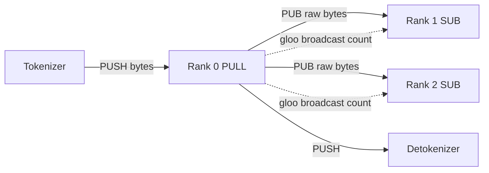

只 rank 0 持有对外 ZMQ。`_recv_msg_multi_rank0`（`io.py:88-122`）的设计：

```python
def _recv_msg_multi_rank0(self, blocking):
    # rank 0 路径
    if blocking:
        raw = self._recv_from_tokenizer.get_raw()    # 阻塞拿一个
        self._send_into_ranks.put_raw(raw)            # ⭐ raw bytes 转发
        pending_msgs.append(self._recv_from_tokenizer.decode(raw))
    pending_raw_msgs = []
    while not self._recv_from_tokenizer.empty():     # 非阻塞排空
        pending_raw_msgs.append(self._recv_from_tokenizer.get_raw())
    
    src_tensor = torch.tensor(len(pending_raw_msgs))
    self.tp_cpu_group.broadcast(src_tensor, root=0).wait()  # ⭐ 广播 count
    
    for raw in pending_raw_msgs:
        self._send_into_ranks.put_raw(raw)
        pending_msgs.append(self._recv_from_tokenizer.decode(raw))
    return pending_msgs
```

**raw bytes 转发**避免 rank 0 解码再编码（msgpack ≠ 零成本）。**count broadcast** 让 rank > 0 知道这一 tick 该 SUB 多少条——PUB/SUB 是 best-effort，没有元信号会脱节。

#### 4.7.8 Sharding Map 一览

| 对象                  | 在哪切                      | 通信                    |
| --------------------- | --------------------------- | ----------------------- |
| `q/k/v_proj` 权重     | 沿 head 维（dim 0）         | -                       |
| `gate/up_proj` 权重   | 沿中间维（dim 0）           | -                       |
| `o_proj` 权重         | 沿输入维（dim 1）           | all_reduce              |
| `down_proj` 权重      | 沿输入维（dim 1）           | all_reduce              |
| `embed_tokens`        | 沿 vocab 维（dim 0）        | masked indexing + all_reduce |
| `lm_head`             | 沿 vocab 维（dim 0）        | all_gather + reorder    |
| KV cache              | 沿 num_kv_heads 维          | -                       |
| Attention head        | 各 rank 一份子集            | -                       |
| MoE expert            | intermediate 维             | all_reduce              |

---

### 4.8 Tokenizer 与 Sampler

#### 4.8.1 子系统目标

把字符串变 token id（tokenize），把 token id 流变字符串（detokenize），把 logits 变下一 token（sample）。tokenizer/detokenizer 在独立进程跑（CPU 工作不挡 GPU）；sampler 在 GPU 用 flashinfer kernel。

#### 4.8.2 tokenize_worker 进程主循环

```python
# tokenizer/server.py:60
def tokenize_worker(addr, backend_addr, frontend_addr, ...):
    recv = ZmqPullQueue(addr, create=True)
    send_backend = ZmqPushQueue(backend_addr)
    send_frontend = ZmqPushQueue(frontend_addr)
    ...
    while True:
        msgs = recv.get()
        msgs = _unwrap_msg(msgs)
        # 非阻塞 drain：把队列里现有的全部拿出来一起处理
        while True:
            try: msgs.extend(_unwrap_msg(recv.get_nowait()))
            except: break
        
        # 分类
        tokenize_msgs = [m for m in msgs if isinstance(m, TokenizeMsg)]
        detokenize_msgs = [m for m in msgs if isinstance(m, DetokenizeMsg)]
        abort_msgs = [m for m in msgs if isinstance(m, AbortMsg)]
        
        # 处理
        if tokenize_msgs:
            results = self.tokenize_manager.tokenize(tokenize_msgs)
            send_backend.put(...)
        if detokenize_msgs:
            results = self.detokenize_manager.detokenize(detokenize_msgs)
            send_frontend.put(...)
        if abort_msgs:
            send_backend.put([AbortBackendMsg(m.uid) for m in abort_msgs])
```

**先阻塞、再 drain** 的模式平衡了空闲延迟（无消息时 CPU 不空转）和高负载吞吐（一次处理多个）。

#### 4.8.3 流式 Detokenize：三个 offset 的小机灵

直接一边收 token 一边 `tokenizer.decode(decoded_ids)` 在多字节字符（UTF-8 中文 / emoji / 部分 token 跨字符）场景会"半个汉字"乱码。`DecodeStatus`（`detokenize.py:54`）维护三个 offset：

```
                     decoded_ids:  [t0, t1, t2, t3, t4, t5, t6]
                                         ▲             ▲     ▲
                                         │             │     │
                            surr_offset │      read_offset  len(ids)
                                                                         

                     decoded_str:  "Hello, 世"
                                            ▲
                                       sent_offset
```

每步：
1. 用 `[surr_offset:read_offset]` decode 出 `surr_str`（上一轮已 commit 的"裸"文本，去掉新 token）
2. 用 `[surr_offset:]` decode 出 `read_str`（包含本轮新 token）
3. `new_text = read_str[len(surr_str):]`
4. 如果 `new_text` 不以 `�` (U+FFFD) 结尾且非空 → commit，offset 推进
5. 否则 `find_printable_text` 退到上一个空格 / 换行 / CJK 边界

```python
# detokenize.py:35 (find_printable_text 逻辑)
# 默认按空格切，但碰到 \n 或 CJK 立刻 flush
```

EOS 不进 `decoded_ids`（`detokenize.py:83`），用户看不到 `</s>`。

#### 4.8.4 SamplingParams 与 greedy 判定

```python
# core.py:16
@dataclass
class SamplingParams:
    temperature: float = 0.0
    top_k: int = -1
    top_p: float = 1.0
    ignore_eos: bool = False
    max_tokens: int = 1024
    @property
    def is_greedy(self) -> bool:
        return (self.temperature <= 0 or self.top_k == 1) and self.top_p == 1.0
```

`is_greedy` **OR 而非 AND**：
- `temperature <= 0` → softmax 退化为 one-hot
- `top_k == 1` → 只取最高
- `top_p == 1.0` → 不裁剪概率

只要 (前两者之一 ∧ `top_p==1`) 即可走 argmax。

#### 4.8.5 Sampler 的稀疏构造

```python
# engine/sample.py:53
def prepare(self, batch: Batch) -> BatchSamplingArgs:
    params = [r.sampling_params for r in batch.reqs]
    if all(p.is_greedy for p in params):
        return BatchSamplingArgs(temperatures=None)        # ⭐ 整批 greedy
    
    MIN_P = MIN_T = 1e-6
    ts = [max(0.0 if p.is_greedy else p.temperature, MIN_T) for p in params]
    top_ks = [p.top_k if p.top_k >= 1 else self.vocab_size for p in params]
    top_ps = [min(max(p.top_p, MIN_P), 1.0) for p in params]
    
    temperatures = make_device_tensor(ts, torch.float32, self.device)
    top_k, top_p = None, None
    if any(k != self.vocab_size for k in top_ks):
        top_k = make_device_tensor(top_ks, torch.int32, self.device)
    if any(p < 1.0 for p in top_ps):
        top_p = make_device_tensor(top_ps, torch.float32, self.device)
    return BatchSamplingArgs(temperatures, top_k=top_k, top_p=top_p)
```

**只为有约束的请求分配 tensor**——uniform-no-constraint 批只付 temperature 张量的钱。

#### 4.8.6 四路 Kernel 分发

```python
# engine/sample.py:24-45
def sample_impl(logits, temperatures, top_k, top_p):
    import flashinfer.sampling as sampling
    probs = sampling.softmax(logits, temperatures, enable_pdl=is_sm90_supported())
    if top_k is None and top_p is None:
        return sampling.sampling_from_probs(probs)
    if top_p is None:
        return sampling.top_k_sampling_from_probs(probs, top_k)
    if top_k is None:
        return sampling.top_p_sampling_from_probs(probs, top_p)
    return sampling.top_k_top_p_sampling_from_probs(probs, top_k, top_p)
```

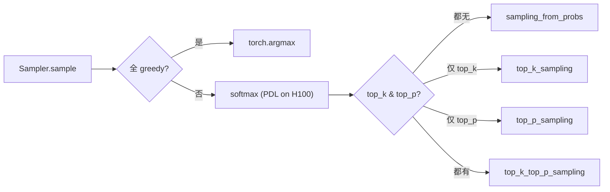

---

### 4.9 自定义 Kernels（C++ JIT + Triton）

#### 4.9.1 子系统目标

围绕 attention/cuBLAS 这些大算子，mini-sglang 还要写一些"过于定制"的小 kernel：KV scatter、embedding gather、CPU 前缀比较、NCCL 包装、MoE 分组 GEMM。它们用 Apache TVM-FFI 编译为可被 Python 调用的 .so，用 Triton 写 MoE。

#### 4.9.2 加载方式：AOT vs JIT

```
                       ┌─────────────────────────────────┐
                       │ csrc/src/      (AOT)           │
                       │ - radix.cpp    fast_compare    │
                       │ - tensor.cpp   self-test       │
                       │ - pynccl.cu    NCCLWrapper     │
                       │ → load_aot 一次性编译         │
                       └─────────────────────────────────┘
                       
                       ┌─────────────────────────────────┐
                       │ csrc/jit/      (按 shape 特化)  │
                       │ - store.cu    store_kv_cache   │
                       │ - index.cu    index_kernel     │
                       │ → load_jit 模板实例化          │
                       │   (element_size, num_splits…)  │
                       │ @functools.cache 同参数复用    │
                       └─────────────────────────────────┘
```

`load_jit` 自动生成包装源：

```cpp
// 自动生成的 wrapper（kernel/utils.py:99）
#include "/path/to/csrc/jit/index.cu"
TVM_FFI_DLL_EXPORT_TYPED_FUNC(launch, (IndexKernel<3072, 4, 256, 1, true>::run));
```

每次 Python 调 `indexing(weights, indices)`，会先按 `(element_size, num_splits)` 找缓存的 module；不存在就编一个新的，缓存到下次。**稳态推理零编译开销**。

#### 4.9.3 一次 indexing() 调用的全链路

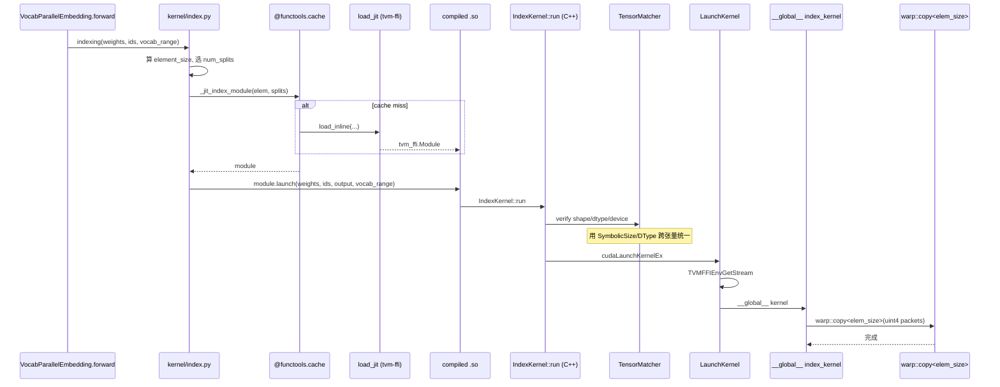

#### 4.9.4 SymbolicSize / TensorMatcher：声明式 shape 检查

```cpp
// store.cu:65 简化
auto D = SymbolicSize{"D"};
auto L = SymbolicSize{"L"};
auto X = SymbolicSize{"X"};   // k_cache stride
auto dtype_ = SymbolicDType{};
auto device_ = SymbolicDevice{};

TensorMatcher({-1, D}).with_strides({X, 1}).with_device<kDLCUDA>(device_)
    .with_dtype(dtype_).verify(k_cache).verify(v_cache);  // ⭐ 同一个 D，绑两次
TensorMatcher({L, D}).with_strides({Y, 1}).with_device<kDLCUDA>(device_)
    .with_dtype(dtype_).verify(k).verify(v);              // L 在这里首次绑
TensorMatcher({L}).with_device<kDLCUDA>(device_)
    .with_dtype<int32_t, int64_t>(indices_dtype_).verify(indices);

const auto dtype_size = dtype_bytes(dtype_.unwrap());
RuntimeCheck(element_size == dtype_size * D.unwrap());
```

读起来像声明式约束："`k_cache` 和 `v_cache` 形状最后一维都叫 D；`k`、`v` 是 `[L, D]`；`indices` 是 `[L]`；所有都同 device 同 dtype。" 失败时 PanicError 带 `std::source_location` 报具体出错行。

#### 4.9.5 warp::copy 矢量化

```
1 个 warp = 32 个 lane，要搬 kElementSize 字节：

if (kElementSize % 16 == 0):                    # 16 字节对齐
    用 uint4 (16 bytes) packet, 每 warp 一轮搬 32 × 16 = 512 字节
elif (kElementSize % 8 == 0):
    用 uint2 (8 bytes), 每 warp 一轮 256 字节
else:
    用 uint  (4 bytes), 每 warp 一轮 128 字节

在编译时由 resolve_unit_size() 选定（warp.cuh:25）
```

#### 4.9.6 Programmatic Dependent Launch (PDL)

```cpp
// utils.cuh:43-56
namespace PDL {
  __device__ __forceinline__ void wait()    { asm volatile("griddepcontrol.wait;"); }
  __device__ __forceinline__ void launch()  { asm volatile("griddepcontrol.launch_dependents;"); }
}
```

PDL 是 Hopper 的小特性：相邻 kernel 在没有数据依赖前缀时，下一个 kernel 可以提前启动（重叠 K1 尾部和 K2 头部）。`KernelConfig.use_pdl = True` 就会：
- host：cudaLaunchAttributeProgrammaticStreamSerialization
- device：每个 warp 启动后先 `griddepcontrol.wait`，结束前 `griddepcontrol.launch_dependents`

#### 4.9.7 Triton MoE Kernel

`kernel/triton/fused_moe.py:51` 是分组 GEMM：

```
A: [M, K]                              所有 token 的输入（M = 总 token 数 × top_k）
B: [E, N, K]                           每 expert 一份权重
C: [M, N]                              输出（再被 moe_sum_reduce 收回 [tokens, hidden]）

sorted_token_ids: [M_pad]              ↘ 由 sgl_kernel.moe_align_block_size 排好
expert_ids:       [num_blocks_m]         同一 BLOCK_M 内必属同一 expert
num_tokens_post_padded                ↗ 让 GEMM tile 对齐 expert 边界
```

**关键技巧**：每个 BLOCK_M tile 严格属于一个 expert，所以 `B[expert_ids[pid_m]]` 加载一次，搜 BLOCK_N 列摊销开销。`even_Ks` 在 K 整除 BLOCK_K 时去掉 mask，省一个 predicate。

```python
# kernel/triton/fused_moe.py 简化
@triton.jit
def fused_moe_kernel(a_ptr, b_ptr, c_ptr, ...):
    pid = tl.program_id(0)
    pid_m, pid_n = group_pid(pid, num_pid_m, GROUP_SIZE_M, ...)  # L2 友好
    expert_id = tl.load(expert_ids_ptr + pid_m)
    # 加载 A 的 BLOCK_M 行（按 sorted_token_ids 间接索引，除以 top_k 还原原 token）
    # 加载 B[expert_id] 的 BLOCK_N × K 块
    # GEMM 累加
    # 写入 C
```

`moe_sum_reduce`（`fused_moe.py:5`）把 `[tokens, top_k, hidden]` 的中间 buffer 沿 top_k 维归约到 `[tokens, hidden]`，用 `tl.range(num_stages=NUM_STAGE)` 软件流水。

#### 4.9.8 优化清单

| # | 优化                                  | 收益                                     |
| - | ------------------------------------- | ---------------------------------------- |
| 1 | 模板化 + JIT 特化                     | 字节数固定的 vector copy                 |
| 2 | @functools.cache module               | 稳态 0 编译                              |
| 3 | num_splits 自适应                     | 大 row 多 warp 协作                      |
| 4 | PDL                                   | 小 kernel 重叠                           |
| 5 | NCCL_WIN_COLL_SYMMETRIC               | 小 all_reduce 走 NVLINK SHARP            |
| 6 | TensorMatcher 跨张量统一              | 检查 + 错误信息一气呵成                  |
| 7 | TVMFFIEnvGetStream                   | kernel 自动跟随 PyTorch 当前 stream      |
| 8 | DLPack 零拷贝                         | Python ↔ C++ 不复制                      |
| 9 | fused_moe 分组 GEMM                   | 单 expert weight 摊销 BLOCK_N 列         |
| 10 | moe_sum_reduce num_stages 软件流水   | 隐藏 GMEM 加载                           |

---

## 第 5 章 · 多 GPU 启动全链路

本章追踪 `python -m minisgl --model X --tp 2` 从命令行到 uvicorn 开门的全过程，让读者把第 2-4 章的拼图最后串起来。

### 5.1 启动时序图

```mermaid
sequenceDiagram
    autonumber
    participant Main as Parent (FastAPI)
    participant S0 as Scheduler 0
    participant S1 as Scheduler 1
    participant Det as Detokenizer
    participant NCCL
    
    Main->>Main: __main__.py → launch_server()
    Main->>Main: parse_args(--tp 2) → ServerArgs
    Main->>Main: run_api_server() 创建 FrontendManager<br/>bind ZMQ frontend (3) + tokenizer (4)
    Main->>Main: mp.set_start_method("spawn"); ack_queue = mp.Queue()
    
    Main->>S0: spawn _run_scheduler(rank=0)
    Main->>S1: spawn _run_scheduler(rank=1)
    Main->>Det: spawn tokenize_worker (作为 detokenizer)
    
    par Engine 初始化
        S0->>S0: cuda.set_device(0), 创建 stream<br/>set_global_ctx
        S0->>S0: dist.init_process_group(gloo,<br/>tcp://127.0.0.1:port+1)
    and
        S1->>S1: cuda.set_device(1), 创建 stream<br/>set_global_ctx
        S1->>S1: dist.init_process_group(gloo)
    end
    
    S0->>NCCL: rank0: module.create_nccl_uid()
    S0->>S1: broadcast_object_list(uid, gloo)
    par NCCL 通信器
        S0->>NCCL: NCCLWrapper(0, 2, max_bytes, uid)<br/>ncclCommInitRank<br/>ncclMemAlloc + WindowRegister
        S1->>NCCL: NCCLWrapper(1, 2, max_bytes, uid)
    end
    
    S0->>S1: all_reduce(MIN) free_memory (gloo)
    
    par 模型加载
        S0->>S0: meta-device 创建模型<br/>load_weight: safetensors → cuda:0<br/>_shard_state_dict[rank=0]<br/>_merge_state_dict (qkv_proj, gate_up)
    and
        S1->>S1: 同上但 [rank=1] 取另一半
    end
    
    S0->>S1: all_reduce(MIN) post-load free_memory
    par KV 池分配
        S0->>S0: num_pages = (mr×free - model)/page_bytes<br/>MHAKVCache + page_table
    and
        S1->>S1: 同上
    end
    
    par CUDA Graph 捕获
        S0->>S0: graph_bs_list = [1,2,4,8,16,...]<br/>每个 bs: warmup + cuda.graph()<br/>录制 NCCL all_reduce
        S0->>NCCL: all_reduce 被捕进 graph
    and
        S1->>S1: 同上
    end
    
    S0->>S0: 构建 CacheManager / Table / Decode / Prefill<br/>SchedulerIOMixin: bind PULL(0) + PUSH(1) + PUB(2)
    S1->>S1: SchedulerIOMixin: 仅 SUB(2)
    
    S0->>S1: tp_cpu_group.barrier()
    S0->>Main: ack_queue.put("Scheduler ready")
    Det->>Main: ack_queue.put("Detokenizer ready")
    
    Main->>Main: drain (num_tokenizer + 2) acks
    Main->>Main: uvicorn.run(host, port)
    Note over Main: HTTP 开始接受请求
```

### 5.2 显存预算的具体数学（Llama-3 8B + 1×H100 + TP=1 例）

```
启动测得 init_free          ≈ 78 GiB （H100 80GB 减去系统占用）
模型加载完测得 post_free    ≈ 62 GiB
model_mem = 78 - 62          = 16 GiB （Llama-3 8B bf16）
available = 0.9×78 - 16      = 54 GiB
cache_per_page (page_size=1) = 2 × 32 × 1 × 8 × 128 × 2 = 128 KiB
                            ↑   ↑   ↑   ↑    ↑    ↑
                          K+V  L  ps kvh  hd   bf16
num_pages = 54 GiB / 128 KiB = 442k 页 ≈ 442k token 容量
```

在 page_size=64（TRT-LLM 强制）下：

```
cache_per_page = 2 × 32 × 64 × 8 × 128 × 2 = 8 MiB
num_pages = 54 GiB / 8 MiB ≈ 6912 页 = 6912 × 64 ≈ 442k token
```

总容量没变，但 page 数变少了——分配粒度变粗，前缀缓存命中率会改变。

### 5.3 CUDA Graph 捕获细节

```python
# engine/graph.py:49-67 (graph_bs_list 选择)
if free_mem > 80 * 1024**3:                   # H200
    max_bs = min(cuda_graph_max_bs or 256, 256)
else:
    max_bs = min(cuda_graph_max_bs or 160, 160)
graph_bs_list = [1, 2, 4] + list(range(8, max_bs + 1, 8))
# = [1, 2, 4, 8, 16, 24, 32, 40, ..., 256]
```

```python
# engine/graph.py:140-147 (捕获循环简化)
pool = None
for bs in sorted(graph_bs_list, reverse=True):     # 大→小，第一图先分
    batch = build_dummy_batch(bs)
    self.attn_backend.prepare_for_capture(batch)
    self.model.forward()                            # warmup
    g = torch.cuda.CUDAGraph()
    with torch.cuda.graph(g, pool=pool):
        self.model.forward()
    if pool is None:
        pool = g.pool()                             # ⭐ 后续图共享同一显存池
    self.graph_map[bs] = g
```

**为什么逆序？** 第一个分配是最大的图，pool 一次性吃饱；后续图都在同一个 pool 里见缝插针，避免显存碎片。

**为什么用 dummy_req？** Captured graph 的所有内存地址固定，要求 batch 结构稳定。dummy_req（指向 dummy KV page，`num_pages` 索引——即多分配的那个 +1 sentinel）让任意 batch padding 到 graph bs 都安全。

### 5.4 启动失败常见原因

| 症状                                             | 可能原因                                         | 排查         |
| ------------------------------------------------ | ------------------------------------------------ | ------------ |
| `GPU memory imbalance: A vs B (>2GB)`            | 多卡显存被其他进程占用不一致                     | `nvidia-smi` |
| `RuntimeError: NCCL ... ncclCommInitRank`        | NCCL 版本不匹配 / NVLINK 失效 / port 占用        | `--use-pynccl false` 暂回退原生 NCCL |
| `Cannot allocate ... MHAKVCache`                  | `--memory-ratio` 太高，或 `--cuda-graph-max-bs` 太大占用 workspace | 降低参数 |
| 父进程卡住"等待 ack"                              | 子进程 panic 但没 panic 父进程                   | 看子进程 stderr / `journalctl` |
| `mp.Process` 启动后 hang                          | spawn 启动 + import 链路问题                     | 检查 main guard |

---

## 第 6 章 · 核心数据结构汇总

mini-sglang 的"五大金刚"：把这五个 dataclass / NamedTuple 看明白，整套系统就过半了。

### 6.1 Req — 请求生命周期载体

```python
# core.py:28
@dataclass
class Req:
    input_ids: torch.Tensor       # CPU int32 1D，随 decode 增长
    table_idx: int                # 在 page_table / token_pool 中的行号
    cached_len: int               # 已被前缀缓存覆盖的 token 数
    output_len: int               # max_tokens 上限
    uid: int
    sampling_params: SamplingParams
    cache_handle: BaseCacheHandle
    # post_init 计算
    device_len: int               # 已分配 KV 槽位的 token 数
    max_device_len: int           # = device_len + output_len
    # property
    can_decode: bool              # remain_len > 0
    extend_len: int               # device_len - cached_len（本次 forward 计算量）
    remain_len: int               # max_device_len - device_len
```

### 6.2 Batch — 引擎一次输入

```python
# core.py:71
@dataclass
class Batch:
    reqs: List[Req]
    phase: Literal["prefill", "decode"]
    input_ids: torch.Tensor       # 后填，由 scheduler 拼装
    positions: torch.Tensor
    out_loc: torch.Tensor
    padded_reqs: List[Req]        # = reqs + dummy_reqs (CUDA graph padding)
    attn_metadata: BaseAttnMetadata
    @property
    def is_prefill(self): return self.phase == "prefill"
    @property
    def is_decode(self): return self.phase == "decode"
    @property
    def size(self): return len(self.reqs)
    @property
    def padded_size(self): return len(self.padded_reqs)
```

### 6.3 Context — 进程级单例

```python
# core.py:100
@dataclass
class Context:
    page_size: int
    page_table: torch.Tensor              # 后填
    attn_backend: BaseAttnBackend
    moe_backend: BaseMoeBackend | None
    kv_cache: BaseKVCachePool
    _batch: Batch | None = None
    
    @contextmanager
    def forward_batch(self, batch):
        old = self._batch
        self._batch = batch
        try: yield
        finally: self._batch = old

# 全局 setter / getter
def set_global_ctx(ctx): global _ctx; _ctx = ctx
def get_global_ctx() -> Context: return _ctx
```

模型层通过 `get_global_ctx().batch.attn_metadata` 拿到 batch，避免 forward 签名穿透。

### 6.4 ForwardInput / ForwardOutput

```python
# scheduler/scheduler.py:35
class ForwardInput(NamedTuple):
    batch: Batch
    sample_args: BatchSamplingArgs
    input_tuple: tuple[Tensor, Tensor]   # (token_mapping, positions)
    write_tuple: tuple[Tensor, Tensor]   # (req_mapping, write_targets)

# engine/engine.py
class ForwardOutput(NamedTuple):
    next_tokens_gpu: Tensor
    next_tokens_cpu: Tensor
    copy_done_event: torch.cuda.Event
```

### 6.5 SamplingParams + BatchSamplingArgs

```python
# core.py:16
@dataclass
class SamplingParams:
    temperature: float = 0.0
    top_k: int = -1
    top_p: float = 1.0
    ignore_eos: bool = False
    max_tokens: int = 1024
    @property
    def is_greedy(self): return (self.temperature <= 0 or self.top_k == 1) and self.top_p == 1.0

# engine/sample.py:14
@dataclass
class BatchSamplingArgs:
    temperatures: Tensor | None        # None 时整批 greedy → argmax 快路径
    top_k: Tensor | None = None
    top_p: Tensor | None = None
```

---

## 第 7 章 · 代码地图与阅读路线

### 7.1 按子系统：一张索引表

| 想看什么                                       | 文件路径                                     | 起始行 |
| ---------------------------------------------- | -------------------------------------------- | ------ |
| **CLI 入口**                                   | `python/minisgl/__main__.py`                 | 1      |
| **CLI 参数定义**                               | `python/minisgl/server/args.py`              | 14, 54 |
| **subprocess 编排**                            | `python/minisgl/server/launch.py`            | 40-113 |
| **FastAPI 路由**                               | `python/minisgl/server/api_server.py`        | 226-340|
| **FrontendManager（uid 多路复用）**            | `python/minisgl/server/api_server.py`        | 100-214|
| **Scheduler 主循环（overlap_loop）**           | `python/minisgl/scheduler/scheduler.py`      | 83-106 |
| **Scheduler `_schedule_next_batch`**           | `python/minisgl/scheduler/scheduler.py`      | 219    |
| **Scheduler `_prepare_batch`**                 | `python/minisgl/scheduler/scheduler.py`      | 204    |
| **Scheduler `_process_last_data`（EOS 检测）** | `python/minisgl/scheduler/scheduler.py`      | 138    |
| **PrefillAdder（chunked prefill）**            | `python/minisgl/scheduler/prefill.py`        | 39-114 |
| **PrefillManager（pending list）**             | `python/minisgl/scheduler/prefill.py`        | 120-151|
| **DecodeManager**                              | `python/minisgl/scheduler/decode.py`         | 全文   |
| **TableManager**                               | `python/minisgl/scheduler/table.py`          | 全文   |
| **CacheManager**                               | `python/minisgl/scheduler/cache.py`          | 15-150 |
| **lazy_free_region**                           | `python/minisgl/scheduler/cache.py`          | 93     |
| **Engine 初始化六步**                          | `python/minisgl/engine/engine.py`            | 30-110 |
| **Engine `forward_batch`**                     | `python/minisgl/engine/engine.py`            | 193    |
| **Engine `_init_communication`**               | `python/minisgl/engine/engine.py`            | 112    |
| **Engine `_determine_num_pages`**              | `python/minisgl/engine/engine.py`            | 150    |
| **GraphRunner CUDA Graph 捕获**                | `python/minisgl/engine/graph.py`             | 78-160 |
| **Sampler.prepare（greedy 快路径）**           | `python/minisgl/engine/sample.py`            | 53     |
| **Sampler.sample / 四路 kernel**               | `python/minisgl/engine/sample.py`            | 24-76  |
| **MHAKVCache（6D 大张量）**                    | `python/minisgl/kvcache/mha_pool.py`         | 10-50  |
| **RadixTreeNode**                              | `python/minisgl/kvcache/radix_cache.py`      | 17-100 |
| **RadixPrefixCache `_tree_walk`**              | `python/minisgl/kvcache/radix_cache.py`      | 205    |
| **RadixPrefixCache `evict`（heap LRU）**       | `python/minisgl/kvcache/radix_cache.py`      | 148    |
| **NaivePrefixCache（无前缀共享）**             | `python/minisgl/kvcache/naive_cache.py`      | 全文   |
| **BaseOP（反射 state_dict）**                  | `python/minisgl/layers/base.py`              | 56-106 |
| **5 种 TP Linear**                             | `python/minisgl/layers/linear.py`            | 13-127 |
| **AttentionLayer**                             | `python/minisgl/layers/attention.py`         | 47     |
| **VocabParallelEmbedding / ParallelLMHead**    | `python/minisgl/layers/embedding.py`         | 14-110 |
| **RotaryEmbedding（functools.cache）**         | `python/minisgl/layers/rotary.py`            | 12-119 |
| **RMSNormFused**                               | `python/minisgl/layers/norm.py`              | 23-38  |
| **MoELayer**                                   | `python/minisgl/layers/moe.py`               | 9-59   |
| **GatedMLP / RopeAttn / MoEMLP**               | `python/minisgl/models/utils.py`             | 25-125 |
| **Llama 模型**                                 | `python/minisgl/models/llama.py`             | 全文   |
| **Qwen-3 模型（带 q/k norm）**                 | `python/minisgl/models/qwen3.py`             | 全文   |
| **`_shard_state_dict`（TP 切片规则）**         | `python/minisgl/models/weight.py`            | 13-42  |
| **`_merge_state_dict`（QKV 合并）**            | `python/minisgl/models/weight.py`            | 45-68  |
| **`load_weight`（safetensors → GPU）**         | `python/minisgl/models/weight.py`            | 71-88  |
| **HybridBackend（prefill/decode 分流）**       | `python/minisgl/attention/base.py`           | 37     |
| **FlashAttention 后端**                        | `python/minisgl/attention/fa.py`             | 全文   |
| **FlashInfer 后端 + lazy plan**                | `python/minisgl/attention/fi.py`             | 全文   |
| **TRT-LLM 后端**                               | `python/minisgl/attention/trtllm.py`         | 全文   |
| **DistributedCommunicator（plugin stack）**    | `python/minisgl/distributed/impl.py`         | 63-90  |
| **PyNCCLWrapper（C++）**                       | `python/minisgl/kernel/csrc/src/pynccl.cu`   | 74-175 |
| **`init_pynccl`（gloo 广播 UID）**             | `python/minisgl/kernel/pynccl.py`            | 45-78  |
| **tokenize_worker 主循环**                     | `python/minisgl/tokenizer/server.py`         | 31-110 |
| **TokenizeManager（HF 包装）**                 | `python/minisgl/tokenizer/tokenize.py`       | 14-31  |
| **DetokenizeManager（流式 offset）**           | `python/minisgl/tokenizer/detokenize.py`     | 54-111 |
| **find_printable_text**                        | `python/minisgl/tokenizer/detokenize.py`     | 35     |
| **ZMQ message types**                          | `python/minisgl/message/{backend,tokenizer,frontend}.py` | 全文 |
| **自动序列化（递归 __dict__）**                | `python/minisgl/message/utils.py`            | 20-100 |
| **ZmqPushQueue / PullQueue 等**                | `python/minisgl/utils/mp.py`                 | 33-129 |
| **load_aot / load_jit**                        | `python/minisgl/kernel/utils.py`             | 53-129 |
| **store_cache（KV scatter）**                  | `python/minisgl/kernel/store.py` + `csrc/jit/store.cu` | 全文 |
| **indexing（embedding gather）**               | `python/minisgl/kernel/index.py` + `csrc/jit/index.cu` | 全文 |
| **fast_compare_key（C++）**                    | `python/minisgl/kernel/csrc/src/radix.cpp`   | 19     |
| **fused_moe Triton kernel**                    | `python/minisgl/kernel/triton/fused_moe.py`  | 全文   |
| **TensorMatcher / SymbolicSize**               | `python/minisgl/kernel/csrc/include/minisgl/tensor.h` | 140-360|

### 7.2 三种推荐阅读顺序

#### 路径 A：彻底理解全系统（约 4-6 小时）

```
1. README.md + docs/structures.md + docs/features.md      [30 min]
2. server/launch.py + server/api_server.py                 [60 min]
3. core.py + scheduler/scheduler.py overlap_loop           [60 min]
4. scheduler/prefill.py + scheduler/decode.py              [40 min]
5. engine/engine.py + engine/graph.py + engine/sample.py   [50 min]
6. kvcache/mha_pool.py + kvcache/radix_cache.py            [60 min]
7. layers/linear.py + models/llama.py                       [40 min]
8. attention/{base,fa,fi}.py                                [40 min]
9. distributed/impl.py + kernel/csrc/src/pynccl.cu          [30 min]
10. tokenizer/{server,detokenize}.py                       [30 min]
```

#### 路径 B：找性能瓶颈（约 2 小时）

```
1. scheduler/scheduler.py overlap_loop（双流）
2. engine/engine.py forward_batch（CUDA Graph 判定）
3. engine/graph.py（捕获列表 / pool 共享）
4. attention/{fa,fi}.py prepare_for_replay
5. scheduler/cache.py allocate_paged + lazy_free_region
6. kernel/csrc/src/pynccl.cu（symmetric memory）
7. ENV.* 开关（python/minisgl/env.py）
```

#### 路径 C：理解前缀缓存（约 1.5 小时）

```
1. kvcache/base.py（接口）
2. kvcache/radix_cache.py（树 + LRU）
3. scheduler/cache.py（桥接）
4. scheduler/prefill.py（PrefillAdder match + lock 流程）
5. kernel/csrc/src/radix.cpp（C++ 比较）
```

### 7.3 测试入口（学源码的好教材）

```
tests/core/test_scheduler.py        - 调度器主流程的最小复现
tests/core/test_cache_allocate.py   - 前缀缓存边界
tests/kernel/test_store.py          - KV scatter
tests/kernel/test_index.py          - embedding gather
tests/kernel/test_tensor.py         - SymbolicSize 校验
tests/kernel/test_comm.py           - PyNCCL all_reduce/all_gather
tests/misc/test_serialize.py        - 自动序列化
```

读测试比读注释更直接——它们演示了每个对象怎么被构造、调用、销毁。

---

## 第 8 章 · 性能优化全清单

按层级整理 mini-sglang 中所有"为性能而做"的设计决策。

### 8.1 系统级

| #  | 优化                                  | 文件                            |
| -- | ------------------------------------- | ------------------------------- |
| 1  | 多进程 GIL 隔离（HTTP/tokenize/GPU）  | `server/launch.py:47`           |
| 2  | PID 后缀 IPC（多实例可同机共存）      | `scheduler/config.py:8`         |
| 3  | 单 binder + 早 bind 后 spawn          | `server/api_server.py:403`      |
| 4  | 共享 tokenizer/detokenizer 进程       | `server/args.py:30-35`          |
| 5  | 懒启 listen 协程                      | `server/api_server.py:126`      |
| 6  | per-uid asyncio.Event 多路复用        | `server/api_server.py:117-152`  |
| 7  | 客户端断连 → AbortMsg 回流            | `server/api_server.py:191-210`  |

### 8.2 调度级

| #  | 优化                                 | 文件                             |
| -- | ------------------------------------ | -------------------------------- |
| 8  | overlap_loop 双流                    | `scheduler/scheduler.py:83-106`  |
| 9  | ForwardInput 跨 tick 存活防 IMA      | `scheduler/scheduler.py:35-42`   |
| 10 | finished_reqs set 幂等防双 free      | `scheduler/scheduler.py:68`      |
| 11 | Prefill-priority + decode 预留       | `scheduler/scheduler.py:222`     |
| 12 | ChunkedReq 子类天然分流              | `scheduler/prefill.py:23-29`     |
| 13 | 全量 reserved_size 防死锁            | `scheduler/prefill.py:77`        |
| 14 | chunked 头插保公平                   | `scheduler/prefill.py:150`       |
| 15 | inflight_tokens 跨页预留             | `scheduler/decode.py:27-30`      |
| 16 | TableManager LIFO 分配               | `scheduler/table.py:9-21`        |

### 8.3 显存级

| #  | 优化                              | 文件                              |
| -- | --------------------------------- | --------------------------------- |
| 17 | meta-device 模型构建              | `engine/engine.py:50`             |
| 18 | safetensors 直落 GPU              | `models/weight.py:81`             |
| 19 | _shard 后再 _merge                | `models/weight.py:13-68`          |
| 20 | 单 6D KV 大张量 K/V 共享          | `kvcache/mha_pool.py:28`          |
| 21 | dummy req + dummy KV page         | `engine/engine.py:89-98`          |
| 22 | radix children 仅哈希首页         | `kvcache/radix_cache.py:233`      |
| 23 | indices.clone() 防写穿            | `kvcache/radix_cache.py:142`      |
| 24 | heap LRU + 懒推父节点             | `kvcache/radix_cache.py:148-173`  |
| 25 | lazy_free_region 合并 cat         | `scheduler/cache.py:93-104`       |
| 26 | free_slots 存 token 索引          | `scheduler/cache.py:20`           |
| 27 | 模型加载后再测显存定 KV 上限      | `engine/engine.py:150-170`        |

### 8.4 GPU 启动级

| #  | 优化                                | 文件                              |
| -- | ----------------------------------- | --------------------------------- |
| 28 | CUDA Graph 阶梯化（[1,2,4,8..256]） | `engine/graph.py:49-67`           |
| 29 | 大→小捕获 + graph.pool() 共享       | `engine/graph.py:140-147`         |
| 30 | non_blocking H2D（pinned memory）   | `scheduler/scheduler.py:238-269`  |
| 31 | non_blocking D2H + Event 仅同步拷贝 | `engine/engine.py:204-208`        |
| 32 | 跨流 wait_stream 同步               | `scheduler/scheduler.py:101-103`  |

### 8.5 计算级

| #  | 优化                                  | 文件                                  |
| -- | ------------------------------------- | ------------------------------------- |
| 33 | greedy 整批 → argmax                  | `engine/sample.py:54-56`              |
| 34 | 稀疏 sampler tensor 分配              | `engine/sample.py:64-67`              |
| 35 | 4 路 flashinfer kernel 分发           | `engine/sample.py:24-45`              |
| 36 | softmax PDL on Hopper                 | `engine/sample.py:32`                 |
| 37 | merged QKV / gate_up GEMM             | `models/weight.py:45-68`              |
| 38 | RMSNormFused 原地 add+norm            | `layers/norm.py:32-38`                |
| 39 | RoPE functools.cache 全模型共享       | `layers/rotary.py:101`                |
| 40 | masked indexing kernel + all_reduce   | `layers/embedding.py:32-42`           |
| 41 | LMHead 仅取 last token (prefill)      | `layers/embedding.py:92-95`           |
| 42 | RopeAttn 用 flag 而非子类             | `models/utils.py:81-118`              |
| 43 | GatedMLP `del` 显式释放中间           | `models/utils.py:46-50`               |

### 8.6 Attention 后端级

| #  | 优化                                    | 文件                       |
| -- | --------------------------------------- | -------------------------- |
| 44 | 全局 page_table 按 page_size=1 存储     | `core.py:103`              |
| 45 | cu_seqlens_q 三快路径（decode/cleam/extend）| `attention/fa.py:84-90`|
| 46 | FlashInfer plan 懒触发                  | `attention/fi.py:122`      |
| 47 | FlashInfer cached_ones buffer           | `attention/fi.py:163-169`  |
| 48 | Hybrid 'fa,fi' 默认（Hopper）           | `engine/engine.py:225`     |
| 49 | TRT-LLM page_size 自动 snap 到 64       | `engine/engine.py:229-231` |
| 50 | BaseCaptureData 持久 buffer             | `attention/utils.py`       |
| 51 | replay 仅写 cu_seqlens_k/seq_lens/page_table | `attention/fa.py:128-136` |

### 8.7 通信级

| #  | 优化                                | 文件                                |
| -- | ----------------------------------- | ----------------------------------- |
| 52 | gloo + PyNCCL 双通信路径            | `engine/engine.py:112-137`          |
| 53 | DistributedCommunicator plugin 栈   | `distributed/impl.py:63-70`         |
| 54 | NCCL_WIN_COLL_SYMMETRIC             | `kernel/csrc/src/pynccl.cu:81-90`   |
| 55 | in-place ncclAllReduce on sym buf   | `kernel/csrc/src/pynccl.cu:107-111` |
| 56 | all_gather 直接走用户 buffer        | `kernel/csrc/src/pynccl.cu:152-160` |
| 57 | get_buffer() 暴露给外部 kernel     | `kernel/csrc/src/pynccl.cu`         |
| 58 | MIN+MAX 一次 all_reduce 编码        | `engine/engine.py:177-189`          |
| 59 | TP-aware raw bytes 转发             | `scheduler/io.py:88-122`            |
| 60 | gloo broadcast count 同步多 rank   | `scheduler/io.py:101-117`           |

### 8.8 Kernel 级

| #  | 优化                                | 文件                                  |
| -- | ----------------------------------- | ------------------------------------- |
| 61 | 模板化按 element_size JIT 特化      | `kernel/store.py:16` `kernel/index.py:16` |
| 62 | @functools.cache 模块缓存           | 同上                                  |
| 63 | num_splits 自适应                   | `kernel/index.py:42-47`               |
| 64 | warp::copy uint4/uint2/uint1        | `kernel/csrc/include/minisgl/warp.cuh:25` |
| 65 | PDL（Hopper griddepcontrol）        | `kernel/csrc/include/minisgl/utils.cuh:43` |
| 66 | TVMFFIEnvGetStream 自动跟随         | `kernel/csrc/include/minisgl/utils.cuh:103` |
| 67 | DLPack 零拷贝                       | tvm-ffi 提供                          |
| 68 | std::mismatch 在 fast_compare_key   | `kernel/csrc/src/radix.cpp:19`        |
| 69 | TensorMatcher 跨张量统一            | `kernel/csrc/include/minisgl/tensor.h:360` |
| 70 | fused_moe 分组 GEMM (grouped pid)   | `kernel/triton/fused_moe.py:117`      |
| 71 | even_Ks 去 mask                     | `kernel/triton/fused_moe.py`          |
| 72 | moe_sum_reduce num_stages 软件流水  | `kernel/triton/fused_moe.py:39`       |

### 8.9 序列化 / 协议级

| #  | 优化                                | 文件                            |
| -- | ----------------------------------- | ------------------------------- |
| 73 | msgpack copy=False                  | `utils/mp.py:25-26, 47`         |
| 74 | 1D Tensor → bytes 直序列化          | `message/utils.py:20-35`        |
| 75 | 自动 __dict__ 递归无样板            | `message/utils.py`              |

至此 75 项主要优化覆盖完毕。

---

## 附录 A · 调试与定位入口

### A.1 环境变量

`python/minisgl/env.py` 定义了所有可调环境变量。常用：

| 变量                              | 默认值 | 作用                                           |
| --------------------------------- | ------ | ---------------------------------------------- |
| `MINISGL_DISABLE_OVERLAP_SCHEDULING` | 0    | 关闭 overlap，回到 normal_loop（用于 debug）  |
| `MINISGL_OVERLAP_EXTRA_SYNC`      | 0      | 在 forward 前加额外 sync (issue #58 workaround)|
| `MINISGL_PYNCCL_MAX_BUFFER_SIZE`  | 1 GiB  | 限制 symmetric memory window 上限              |
| `MINISGL_USE_DUMMY_WEIGHT`        | 0      | 用 randn 替代真实权重（测算资源）              |

### A.2 常用调试技巧

**看每个 tick 在做什么**：
```bash
MINISGL_LOG_LEVEL=DEBUG python -m minisgl --model X --tp 1
```
日志会带 `[rank=0]` 前缀（`utils/logger.py` 的 `info_rank0`）。

**测调度器逻辑（不需要 GPU）**：
`tests/core/test_scheduler.py` 用 mock 模型 + 假 KV cache 跑 scheduler 主循环。

**Profile CUDA 路径**：
```bash
nsys profile --gpu-metrics-device=0 python -m minisgl ...
```
特别关注 engine.stream 与 scheduler.stream 的并行度。

**单 GPU 复现 TP 行为**：
mini-sglang 不直接支持，但可以 `--tp 1` 启动两次（不同 port）做 ZMQ 通信验证。

### A.3 添加新模型

1. 在 `models/` 下新建 `mymodel.py`，参考 `qwen3.py` 写 `MyModel` + `MyModelForCausalLM`
2. 用 `RopeAttn(has_qk_norm=?, has_attn_bias=?)` 选 attention 风格
3. 用 `GatedMLP` 或 `MoEMLP` 选 MLP 风格
4. 在 `models/register.py` 注册架构字符串映射
5. 如果权重命名不标准，重写 `_shard_state_dict` / `_merge_state_dict` 一两个特例

通常一个新模型 < 80 行代码。

### A.4 添加新 attention 后端

1. 实现 `BaseAttnBackend`（`attention/base.py:18`）的五个抽象方法
2. 定义自己的 `Metadata` dataclass，至少实现 `get_last_indices(bs)`
3. 在 `attention/__init__.py` 用 `@SUPPORTED_ATTENTION_BACKENDS.register("name")` 注册
4. 处理 `prepare_for_capture` / `prepare_for_replay`（CUDA Graph 必需）

参考 `attention/fa.py`（最小实现，~150 行）。

### A.5 加新优化的检查清单

对照下面这张图，确认你新加的优化点不会破坏其他已有机制：

```
                  ┌───────────────────┐
                  │  已修改的代码     │
                  └─────────┬─────────┘
                            │
          ┌─────────────────┼──────────────────┐
          ▼                 ▼                  ▼
    会影响 batch       会改 metadata     会改 KV pages
    形状 / 长度?      shape / dtype?    分配 / 释放?
          │                 │                  │
          ▼                 ▼                  ▼
     CUDA Graph        attention 后端    radix cache 锁定
     padding 安全?      capture/replay?    lazy_free 兼容?
          │                 │                  │
          ▼                 ▼                  ▼
    会跨 overlap_loop   会跨 TP rank?    会改 token_pool?
    边界?(IMA?)         （需 broadcast?）  
```

每条都对应本文档讲过的一个机制，都过一遍就基本不会埋雷。

---

## 总结：mini-sglang 的设计哲学

读完这份文档，你会发现 mini-sglang 的代码风格非常统一，背后有几条设计原则：

1. **每个对象只做一件事**：`Engine` 不知道 ZMQ，`Scheduler` 不知道 attention kernel，`AttentionLayer` 不知道是哪种后端。**接口窄**让每一层都能单独读懂。

2. **全局可达 Context 替代逐层传参**：`get_global_ctx()` 是模型层与引擎层的"暗通道"——CUDA Graph captured kernel 不能传额外参数，全局 context 是唯一办法。代价是单进程只能跑一个推理实例（适合 LLM 服务，但会限制 multi-tenant）。

3. **简单结构 + 反射**：`BaseOP` 替代 `nn.Module`、`message/utils.py` 替代 protobuf——目的是新增字段无样板、误用早爆露。

4. **类继承代替 flag**：`ChunkedReq`、`HybridBackend` 都用子类把"特殊情况"挪出主循环，而不是 `if is_chunked` 散落各处。

5. **优化都标注了 WHY**：从 IMA 防护到 raw bytes 转发，每个非显然的优化在源码注释里都能找到原因。这一点 mini-sglang 比许多生产级项目做得还好——读源码是一种学习。

6. **极致复用业界最优 kernel**：FlashAttention/FlashInfer/TRT-LLM/Triton——mini-sglang 不重复造轮子，专注调度层和系统层。这是它能用 ~5000 行 Python 达到生产级性能的原因。

如果你打算在 LLM 推理领域工作或研究，mini-sglang 是绝佳的"麻雀虽小、五脏俱全"教材；它的每一处设计都有可推广的洞见，值得反复阅读。

---


